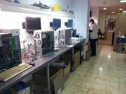
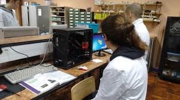

## El puesto de Montaje

## Seguridad en las operaciones de montaje, sustitución y conexión de componentes y periféricos microinformáticos.

## El Puesto de Montaje

* Los talleres o puestos de montaje y reparación de equipos informáticos deberán contar con unas condiciones adecuadas para el buen uso a los que son creados\. A continuación vamos a dar una serie de consejos que vendrán muy bien a la hora de crear o mantener un taller de reparaciones\.
  * __Orden y Limpieza\.__
  * __Temperatura, humedad y ventilación\.__
  * __Iluminación\.__
  * __Ruido\.__
  * __Otros factores a tener en cuenta\.__

Seguridad en las operaciones de montaje, sustitución y conexión de componentes y periféricos microinformáticos

## Orden y Limpieza

Limpieza del taller y puestos de trabajo\. Limpiando los suelos y superficies de trabajo utilizando, para ello, elementos idóneos para su limpieza de polvos, pelusas, etc\., como espray antipolvo,  mapas, etc\.

Ventilación del local\. Ventilación natural o forzada\.

Colocación de las herramientas utilizadas de trabajo en su correspondiente lugar\.

Ordenar y no sobrecargar las estanterías o zonas de almacenamiento\.

Seguridad en las operaciones de montaje, sustitución y conexión de componentes y periféricos microinformáticos

No dejar bolsas, cajas, etc\., por medio del local, hay que depositarla en el contenedor adecuado\.

Mantener las zonas de pasos despejadas, dejando visible y lo más accesible posible los extintores o cualquier otro sistema contra incendio\.

Intentar que los cables estén lo más recogidos posibles para evitar caídas, tirones o roturas del mismo\.

La instalación de redes debería estar por paredes y techos evitando siempre el suelo\.

Seguridad en las operaciones de montaje, sustitución y conexión de componentes y periféricos microinformáticos

## Temperatura, humedad y ventilación

El puesto de trabajo y almacén deberá de mantenerse libre de humedad y temperaturas extremas evitando corrientes de aire molestas, cambios bruscos de la temperatura u olores desagradables\.

La climatización en el taller es siempre importante\. Evitar colocarse en las salidas del aire acondicionado, al lado de radiadores, etc\. Una temperatura media de 22 grados en invierno y 24 en verano suele ser la más adecuada, estando la humedad entre un 30 y un 70% \(si hay riesgo de energía estática deberá estar por debajo de un 50%\)\.

Seguridad en las operaciones de montaje, sustitución y conexión de componentes y periféricos microinformáticos

## Iluminación

Es importante que la luz utilizada sea la adecuada\(ni mucha iluminación ni poca\)\.

Evitar que no haya diferencias bruscas de iluminación entre el puesto de trabajo y sus alrededores evitando en todo momento los deslumbramientos tanto directos como indirectos\.

Los tubos fluorescentes deben estar cubiertos y no incidir directamente sobre la mesa o equipo\. La intensidad de la luz debe ser la adecuada\.

Los puestos de trabajo deberán estar cerca de las ventanas y evitando que la luz que entra incida sobre la pantalla del ordenador y provoque reflejo al trabajador\. Si es necesario se utilizarán mamparas, cortinas u otro elemento que impida los reflejos\.

Seguridad en las operaciones de montaje, sustitución y conexión de componentes y periféricos microinformáticos

## Ruido

El ruido es otro factor a evitar dentro de un taller\. Muchas de la actividades a realizar dentro del taller necesitan de un mínimo de concentración y este no puede conseguirse con un nivel de ruido adecuado\.

Los ruidos no deberían sobrepasarse los 55 decibelios\. Se procurará que en el taller no sea ruidoso, si es necesario habilitar una sala para los equipos que más ruido hacen \(servidores y algunas Workstation\) y examinar periódicamente mediante audímetros el nivel de ruido\.

Las vibraciones del aire acondicionado, máquinas, impresoras, tráfico, etc\., son un elemento perturbador y deben ser reducidas o eliminadas en lo posible\.

Seguridad en las operaciones de montaje, sustitución y conexión de componentes y periféricos microinformáticos

## Otros factores a tener en cuenta

Los cables de datos no deben de estar en contacto con los cables de tensión\.

Las instalaciones eléctricas deberán estar en buen estado y revisadas\.

Evitar sobrecargar las tomas utilizando adaptadores múltiples y regletas\. Intentar repartir la carga entre los enchufes que tengamos disponibles\. En muchas ocasiones las sobrecargas producen incendios\.

Apagar los equipos \(pantallas, altavoces, impresoras…\) cuando se abandona el local puesto que estos se recalientan

Seguridad en las operaciones de montaje, sustitución y conexión de componentes y periféricos microinformáticos

Separar los equipos de la pared para evitar sobrecalentamiento\.

Intentar que los enchufes y aparatos tengan toma de tierra\. Instalar toma de tierra en interruptores diferenciales de corriente\.

Disponer de un sistema contra incendios adecuado\. Extintores y salidas de incendios deben  estar correctamente señalizados y operativos\.

El factor psicosocial en la oficina es muy importante\. Hay que intentar que los procedimientos de trabajo estén claros y la organización sea la adecuada\.

Seguridad en las operaciones de montaje, sustitución y conexión de componentes y periféricos microinformáticos

Los empleados que trabajen en el montaje y reparación de equipos informáticos deberán seguir las instrucciones del fabricante\.

Los techos deberán ser blancos y las paredes estar pintadas en tonos medios\. Se recomienda introducir colores estimulantes en el entorno\.

En oficinas que tengan mucha carga electrostática, ésta se puede reducir aumentando la humedad en el aire o utilizando productos antiestáticos\.

No utilizar pantallas de ordenadores muy pequeñas pues provocan fatiga  visual dado que el tamaño de los caracteres en los textos es más pequeños\.

Seguridad en las operaciones de montaje, sustitución y conexión de componentes y periféricos microinformáticos

Ajustar correctamente el contraste y luminosidad de la pantalla del ordenador\. Normalmente los fabricantes aconsejan los parámetros más adecuados\.

Evitar en lo posible los monitores CRT\. Los nuevos monitores tienen menos reflejos  y mejores capacidades de contraste con lo cual los hacen más adecuados\.

El mobiliario \(silla, mesa, etc\.\) debe ser lo más cómodo posible, debe poder ajustarse y debe tener un acabado \(sin aristas, sin reflejos, etc\.\)\.

Las sillas son muy importantes\. Se recomienda la utilización de una silla ajustable, ergonómica y cómoda para el trabajador\.

Seguridad en las operaciones de montaje, sustitución y conexión de componentes y periféricos microinformáticos

