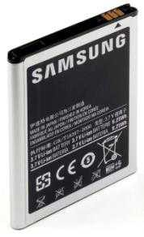
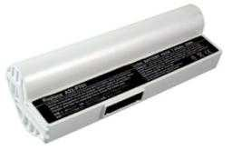
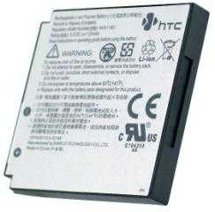
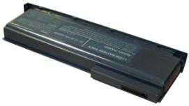
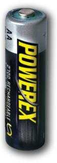
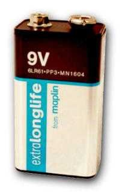
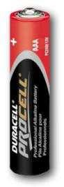
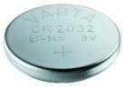
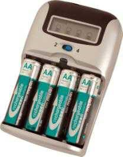
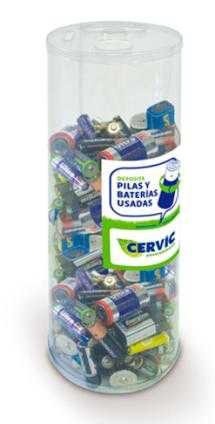

# Consumibles de energía

* __Consumibles de energía__
  * Se utilizan para suministrar electricidad a un componente del sistema para su funcionamiento\.
  * Entre otros, serian las pilas y las baterías\.
* Portátiles
  * Vienen equipados con una batería ara que puedan funcionar de forma autónoma
  * Cada marca, e incluso cada modelo, tiene un tipo distinto de batería
    * Diferente forma y diferentes valores de voltaje y capacidad
  * Hay fabricantes que venden  __baterías__   __genéricas__  para diversos modelos de portátil\.

## Baterías

  * Compuesta por celdas donde se almacena la energía\.
  * A más celdas, más duración\.
  * Existen diferentes tipos de baterías \(dependiendo de los componentes químicos de su interior\)
  * Las más utilizadas en la actualidad son las de iones de Litio \(Ll\-lon\)
  * Pueden llegar a durar hasta 9 horas\.

## Power banks

  * Las necesidades de los dispositivos portátiles ha generado en el mercado un nuevo modelo de batería denominado  __“__  __power__  __ __  __bank__  __”\. __
  * Batería externa, que se carga
    * Directamente a la red eléctrica
    * Mediante un cable USB a un equipo\.
  * Una vez cargada, puede utilizarse para cargar otros dispositivos \(móviles, tablets\)

## Pilas

  * Para componentes que no están conectados directamente a la corriente
  * Dispositivos  __inalámbricos__ \.
  * Distintos tipos \(compuestos, formas y voltajes\)
  * Las que más duran son las  __alcalinas__
* Modelos más usados son estos:

## Conservación de pilas y baterías

* __Conservación de consumibles de energía__
  * Antes de usar por primera vez  __gastar la carga__  de la que trae de fábrica
  * Posteriormente  __cargarla por completo__ \.
  * Siguientes 5 o 6 recargas: esperar a que se descargue por completo
    * La batería se adapta a sus niveles máximos y mínimos\.
  * Después, cargar y descargar sin esperar al 100% de carga/descarga\.
  * Las baterías tienden a volverse «vagas», pierden eficiencia\.
* Cargador
  * Imprescindible utilizar el  __cargador__  que nos provee el  __fabricante__
  * En su defecto, uno de iguales  __características__
    * Podríamos darle un voltaje e intensidad incorrectos, pudiendo incluso dejar inservible la batería

* __Conservación de consumibles de energía__
  * Limpieza de las  __conexiones__
  * Impurezas
    * óxido, suciedad, polvo
    * Suponen una resistencia al paso de la energía y provocan sobrecalentamiento
  * Para limpiarlas utilizaremos un paño impregnado en  __alcohol__  o  __disolvente__  específico\.
  * Evitar conectar la batería si existen humedades en los contactos \(cortocircuito\)
  * No se debe acercarlas a fuentes de calor
  * Cuando se prevé que una pila o una batería no se va a utilizar en un largo tiempo
    * Retirarla para evitar su descarga y su posible deterioro\.

## Reciclaje de pilas y baterías

* __Medidas de reciclaje de consumibles de energía__
  * Las pilas y las baterías no se pueden tirar en la basura
  * Guardar en cajas o bolsas impermeables
* Las pilas se llevan
  * A  __contenedores específicos __ para ellas
  * A un  __punto limpio__
* En España
  * Fundaciones y asociaciones, como  __Ecopilas__  o  __Asimelec__
  * Se encargan del tratamiento de estos residuos\.
* Contaminación
  * 1  __pila de botón __ puede contaminar hasta 600\.000 litros de agua

## Sustitución de pilas y baterías

* __Pilas y baterías__
  * La mayoría de los dispositivos que funcionan mediante pilas o baterías incorporan un medio para avisar al usuario de un nivel bajo de energía\.
* Sustitución
  * Procedimiento simple que consiste en quitar la vacía para poner la llena\.
  * Comprobar voltajes de las pilas y baterías nuevas coinciden con las necesidades del dispositivo\.
  * Reemplazo de pilas y baterías siempre con el dispositivo apagado y desconectado de la corriente\.
* Si un dispositivo funciona con más de una pila o batería
  * Cambiar  __todas__  a la vez
  * Utilizarlas  __misma__   __marca__  y  __características__
    * Mezclar pilas nuevas con gastadas provoca que las nuevas se desgasten más rápido
    * Rendimiento es menor y la solución más cara\.
    * Lo mismo sucede si se mezclan, por ejemplo, pilas estándar con pilas alcalinas\.