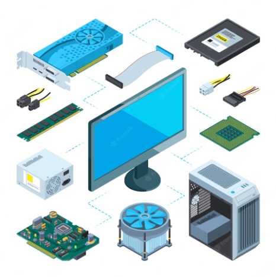

[🔙 Enrere](../) | [🏠 Pàgina principal](http://danimrprofe.github.io/apuntes/)

# Hardware

El hardware es la **parte física** de un sistema informático, que incluye todos los componentes físicos y materiales que forman el sistema, como los dispositivos de entrada, salida, almacenamiento, procesamiento y comunicación.

Estos **componentes** incluyen: procesadores, tarjetas de memoria, unidades de disco, tarjetas de red, tarjetas de sonido, tarjetas de video, unidades de almacenamiento, teclados, mouse y otros dispositivos.

