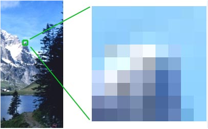

# 2. Bitmaps e imágenes vectoriales

## IMÁGENES DE MAPAS DE TOS (BITMAPS)

Las imágenes de mapa de bits están descritas mediante una gran cantidad de cuadrados, llamados ``píxeles``, que están rellenos de color aunque sólo sea blanco o negro (cada píxel de un color, mezcla del Rojo, verde y azul).

## IMÁGENES VECTORIALES

Se componen de contornos y refíenos definidos matemáticamente (vectorialmente) mediante precisas ecuaciones que describen perfectamente cada ilustración.

Otra diferencia importante es el peso que tienen en disco 0° que ocupan); las imágenes vectoriales pesan poco, mientras que las de mapas de bits pesan mas que las vectoriales.

Las representaciones en mapa de bits son muy aconsejables cuando el original presente una gran tonalidad de colores, aunque sean grises, como es el caso de las fotograf as o las reproducciones de pinturas, sin embargo, las imágenes vectoriales son idóneas cuando se trate de representar ilustraciones compactas, con poca variación en su gama de colores y que requieren contornos precisos y susceptibles de ser escaladas, como	logotipos o	imágenes	corporativas que se	reproducen a	diferentes	tamaños,	desde	una	tarjeta	de
visita hasta un panel publicitario de grandes dimensiones.

También	hay que	tener	presente	que cualquier	imagen	digital,	ya	sea	vectorial	o mapa de bits,	se
representará e imprimirá en “modo píxel”.