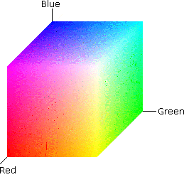

# 4. Color

## 4.1	PROFUNDIDAD DE COLOR (PROFUNDIDAD DE PÍXEL)

Se llama profundidad de color a la cantidad de colores diferentes que pueden presentarse en una imagen. Para almacenar esta información se asigna un número de bits para indicar el color de cada pixel.

Si quisiéramos saber el color de un pixel en una imagen de 16 colores necesitaríamos 16 (=24), combinaciones diferentes esto es 4 bits y así sucesivamente.

Veamos los bits necesarios para cada profundidad de color.
Número de bits	Combinaciones posibles	Número de colores
8	28	256
16	216	Aprox 65000
24	^24_	16,7 millones

## 4.2. MODOS DE COLOR

Fundamentalmente existen cuatro modos de color que son:

- HSB (tono, saturación y brillo)
- RGB (red, green y blue o RVA, rojo, verde y azul)
- CMYK (cián, magenta, amarillo y negro)

## 4.3. COLOR HSB

Está basado en el modo en que el ojo humano percibe el color, por lo tanto se trata del modo más "natural" y atiende a tres características fundamentales:

- **Tono**: Normalmente esta característica se confunde con el nombre del color en cuestión y se refere a la longitud de onda de la luz refejada o emitida por un objeto.
- **Saturación**: Es la intensidad del color y representa el matiz en relación al tono, midiéndose en términos de porcentaje de 0% a 100% (saturación máxima* También se le conoce con el término "croma".
- **Brillo**: Consiste en la claridad u oscuridad relativa a cada tono de color y se mide también en porcentaje de 0% (negro) al 100%> (blanco).

## 4.4	COLOR RGB

Este modo es el más cercano al ser el que se usa en la iluminación artificial y en la mayoría de monitores y pantallas gráficas proporcionando la mayoría del espectro visible mezclando las luces generadas por fósforos rojos, verdes y azules. Estos tres colores primarios crean el banco cuando se combinan simultáneamente por eso se llaman también "aditivos".

Teniendo en cuenta que en la memoria del ordenador (a RAM), la memoria está organizada en boques de 8 bits (1 byte) para almacenar los datos, por tanto en 1 byte se pueden almacenar 256 colores. Por ello, en cada canal:

- **Rojo**	Presenta 28 tonalidades diferentes, es decir 256 tonalidades.
- **Verde**	Presenta 2 tonalidades diferentes, es decir 256 tonalidades.
- **Azul**	Presenta 2 tonalidades diferentes, es decir 256 tonalidades.

Por ello, cada píxel podrá tener: 256x256x256 = **16 millones de colores diferentes**

## 4.5	COLOR CMYK

Este sistema responde a una idea totalmente opuesta al anterior, puesto que, en vez de basarse en una fuente de luz para generar las mezclas de los colores primarios, se basa en la propiedad de la tinta impresa en papel de absorber la luz que recibe.

Cuando una luz banca incide sobre tintas translúcidas, éstas absorben parte del espectro de modo que el color no absorbido se refleja. En el plano teórico, los pigmentos mezclados de cián, magenta y amarillo deberían absorber todo el espectro, produciendo, en consecuencia, negro. Por esta razón son llamados "colores sustractivos". En la práctica todas las tintas contienen impurezas y ello ocasiona que la mezcla genere un color marrón oscuro, siendo necesario perfilar con tinta negra para conseguir un color negro auténtico.