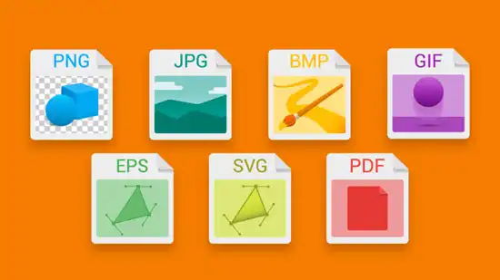
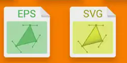
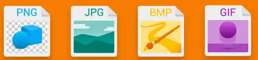

# 6	FORMATOS DE ARCHIVO.

Una vez que tenemos nuestra imagen, lo normal es que la guardemos en un archivo. Esta acción de guardado generará un archivo que contendrá:

- Los bits que describen la imagen
- Información sobre la propia imagen

## Formatos de edición de imágenes

Los siguientes formatos son propios de ciertos programas, y contienen el proyecto que se está realizando con ese programa. Es decir, no es la versión defintiva de la imagen y por tanto no las podemos ver si no las abrimos con el programa en concreto.

El formato de una imagen es la estructura de datos en la que se guarda la imagen. Cada formato tiene unas características concretas que lo diferencian.

- **JPEG** (Joint Photographic Experts Group;Grupo de Expertos en Fotografía): formato de compre-sión muy utilizado. Es el habitual en las cámaras fotográficas. El proceso, no obstante, acarrea una pérdida de calidad de imagen, aunque no se aprecia a simple vista.
- **GIF** (Graphics Interchange For-mat; formato de intercambio de gráficos): mantiene íntegra la calidad de origen. Se usa mucho para animaciones.
- **BMP** (Bit Mapped Picture; mapa de bits): creado por Microsoft.
- **TIFF** (Tagged Image File Format;formato de archivo de imágenes con etiquetas): archivo de gráfi cos de mapa de bits muy grandes. Se utiliza en artes gráficas. t
- **PNG** (Portable Network Graphics; gráfi cos de red portables): man-tiene íntegra la calidad original y soporta transparencia

| Extensión  | Características                                                                                                                                                                                    |
| ---------- | -------------------------------------------------------------------------------------------------------------------------------------------------------------------------------------------------- |
| bmp        | Formato típ^ico de Paint. No pierden calidad aunque se manipulen muchas veces. Profundidad de color de 24 bits (16 millones de colores) Se puede comprimir sin pérdidas. No admite transparencias. |
| gif        | Profundidad de color de 8 bits (256 colores) Se puede comprimir sin pérdidas. Admite transparencias.                                                                                               |
| jpg o jpeg | Profundidad de color de 24 bits (16 millones de colores) Se puede comprimir con pérdidas, pero el usuario puede elegir el grado de compresión. No admite transparencias.                           |
| png        | Profundidad de color de 24 bits (16 millones de colores) o de 8 bits (256 colores) Se puede comprimir sin pérdidas. Admite transparencias.                                                         |
| tif o tiff | Profundidad de color de hasta 64 bits. Se puede comprimir sin pérdidas. Admite transparencias. Es ideal para imprimir.                                                                             |
| xcf        | Archivo original de Gimp.Profundidad de color de 8 bits por canal (16 millones de colores) Admite transparencias                                                                                   |
| psd        | Archivo original de Photoshop Document. Profundidad de color de 8 bits por canal (16 millones de colores). Admite transparencias                                                                   |
| raw        | Condene la información de la imagen tal y como fue adquirida por el sensor.                                                                                                                        |
| pict o pct | Formato de imagen de Macintosh Profundidad de color de hasta 64 bits Se puede comprimir sin pérdidas. Admite transparencias.                                                                       |

## Formatos de archivos vectoriales

| Extensión | Características                                                      |
| --------- | -------------------------------------------------------------------- |
| wmf       | Es típico de las aplicaciones de Windows.                            |
| odg       | Corresponde al estándar abierto de documentos (odt) de OpenOfice.org |
| cdr       | Típico de la aplicación Corel Draw.                                  |
| swf       | Animación de Macromedia Flash.                                       |
| dxf       | Utilizado en programas de arquitectura, como Autocad o Qcad.         |
