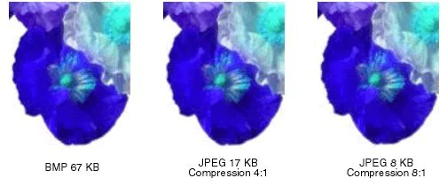

# 7. Compresión

La compresión con pérdidas en imagen digital se refiere a la compresión de imágenes en la que se sacrifican algunos detalles de la imagen original para reducir el tamaño de los datos. Esto se logra eliminando información no esencial de la imagen para reducir el tamaño de los datos sin afectar demasiado la calidad de la imagen.

El formato **JPEG** es el más común para comprimir imágenes con pérdidas.

En contraste, la compresión sin pérdidas en imagen digital se refiere a la compresión de imágenes en la que no se sacrifican detalles de la imagen original para reducir el tamaño de los datos. Esto se logra utilizando algoritmos de compresión sin pérdidas que buscan patrones repetidos en la imagen para reducir el tamaño de los datos sin sacrificar detalles de la imagen.

El formato **PNG** es el formato más común para comprimir imágenes sin pérdidas.