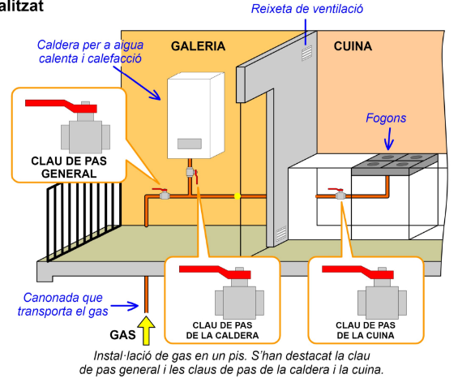
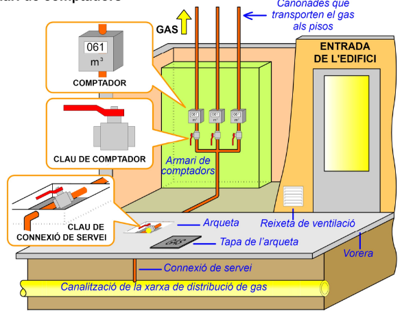
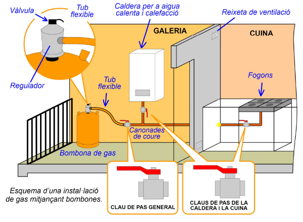

# La instal·lació de gas 

## 1. La instal·lació de gas 

La instal·lació de gas, juntament amb la d'electricitat, aporta l'energia que necessita un habitatge per ser confortable. El gas s'utilitza com a combustible, fonamentalment per a 3 usos: 

- calefacció
- escalfar aigua sanitària 
- fer funcionar els fogons de la cuina. 

Hi ha dues maneres de subministrar gas a un habitatge: 

- mitjançant gas **canalitzat** 
- mitjançant **bombones** de gas. 
 
Els gasos més utilitzats són el gas natural i el butà. 

- El **gas natural** es distribueix canalitzat per mitjà d'una xarxa de canonades soterrades. 
- El **butà** es distribueix emmagatzemat en bombones que es transporten en camions fins als clients. 

També s'utilitza **gas propà**, especialment en zones rurals, ja sigui en bombones o en instal·lacions canalitzades que donen subministrament a petites poblacions o grups d'habitatges. 

Construcció d'un gasoducte per transportar gas natural des dels dipòsits d'emmagatzematge fins a les poblacions consumidores. 

# 2. Instal·lació mitjançant gas canalitzat 

La instal·lació de gas d'un habitatge està formada per canonades de coure 
que condueixen el gas fins als calenta i calefacció receptors: la caldera i els fogons de la cuina. 

Les **canonades** han de ser vistes, no encastades a la paret com les de l'electricitat. S'instal·len diverses vàlvules, o claus de pas, que permeten tallar la circulació de gas si hi hagués una fuita o fos necessari fer una 
reparació. 

**Clau de pas general**

La més important d'aquestes vàlvules és la **clau de pas genera**l que talla el subministrament a tot l'habitatge. A l'entrada de la caldera i dels fogons es col·loquen altres vàlvules, que obren o tanquen el pas de gas per a cada aparell individual. És important que els espais on es crema el gas estiguin ben ventilats, per això s'han d'instal·lar reixetes que permetin el pas de l'aire. 

Als pisos, la caldera se situa freqüentment a la **galeria**. 
Instal·lació de gas en un pis. S'han destacat la clau de pas general i les claus de pas de la caldera i la cuina. 

# 3. La connexió de servei i l'armari de comptadors 

Al carrer, soterrada sota la vorera, hi transporten el gas passa la canalització de la xarxa de  als pisos distribució que subministra el gas als abonats. La canonada que connecta un edifici (o una casa) a aquesta canalització s'anomena **connexió de servei**. Aquesta canonada té una vàlvula, la clau de connexió de servei, que permet, si cal, tallar el subministrament a tot l'edifici. 

Dins d'aquest, normalment en un armari situat en un lloc ventilat, s'hi col·loquen els **comptadors de gas**. Cada abonat té un comptador, la qual cosa permet a la companyia subministradora saber quants metres cúbics de gas consumeix i elaborar la factura. 

## 4. Instal·lació mitjançant bombones de gas 

Les instal·lacions alimentades per bombones de gas són més senzilles i barates, però tenen l'inconvenient d'haver de canviar les bombones quan s'acaben. 
Caldera per a aigua calenta i calefacció 

Com pots veure a la il·lustració, la font de gas és una bombona metàl·lica que es connecta a les canonades de coure mitjançant un **tub flexible**. A l'extrem d'aquest tub hi ha un **regulador** (aparell que manté la pressió de gas estable) amb una **vàlvula** que permet obrir o tancar el pas del gas. El tub flexible s'ha de canviar periòdicament. 

