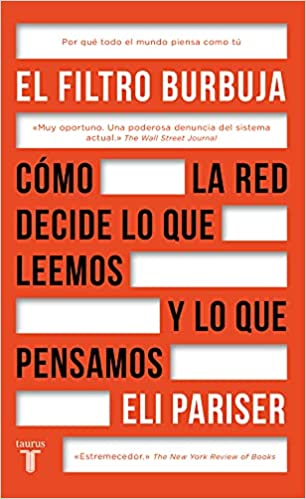
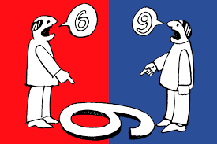
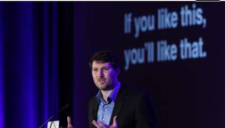

# La burbuja de filtros

        “Un buen día te despiertas y te encuentras con que todo el mundo piensa como tú”

## Reflexión

¿Qué posibilidades tenemos de descubrir algo diferente si todos los resultados de búsquedas que realizamos están basados en nuestros gustos, preferencias y búsquedas anteriores?
¿Qué me estoy perdiendo?

## ¿Qué es la burbuja de filtros?

La burbuja de filtros es un concepto de la web 2.0 que se refiere a la tendencia de un usuario a interactuar principalmente con contenido, personas y opiniones que coinciden con sus propios intereses y preferencias. Esta "burbuja de filtros" puede contribuir a la polarización de opiniones, ya que los usuarios reciben una selección limitada de opiniones y contenido.

## ¿Cómo se crea?

Esta burbuja se crea cuando los motores de búsqueda o redes sociales **recopilan información** sobre los intereses de un usuario para **mostrar contenido relevante** para ese usuario. Esto significa que los usuarios reciben contenido y opiniones que coinciden con su **propia visión** del mundo, lo que puede llevar a la polarización de opiniones.

## Video de Eli Parisier

Eli Parisier en una charla TED:

https://www.ted.com/talks/eli_pariser_beware_online_filter_bubbles?language=es

