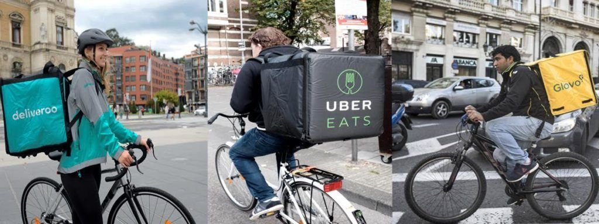
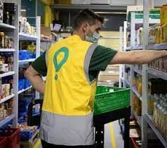

# Nuevas profesiones y negocios en la era digital

## Introducción

- Expansión de las TIC
- Nuevos modelos de negocio
- Nuevas profesiones
- Acceder a servicios en tiempo real
- A través de **smartphone**

- Nuevo modelo digital
- Ahorra costes de producción y une a los consumidores
- Reduce los precios
- Elimina barreras de entrada al mercado.

## Ejemplos

- Uber es ya una de las mayores empresas de transporte del mundo, sin tener coches en propiedad

- Airbnb es la mayor red de alojamientos sin tener ni una sola habitación de hotel

- Glovo es la mayor red de distribución sin tener trabajadores contratados.

## Mobilidad. Uber y cabify

- Alquiler de vehículo con conductor (VTC)
- Trayectos relativamente cortos
- Servicio lo presta un conductor profesional (licencia)
- Contratar online mediante apps propias.
- Obligación de contratar siempre con antelación
- 30 minutos de antelación en Baleares

## Carpooling

- Viajar en coche compartido (carpooling)
- Sufragar en común los gastos del trayecto
- Conductores son personas particulares.
- En España, plataformas como Amovens o, principalmente, BlaBlaCar

## Delivery

http://www.youtube.com/watch?v=NL_217-Iygc

- Recogida y reparto a domicilio, mayoritariamente de comida, mediante plataformas de reparto.
- Uber Eats, Deliveroo, Glovo y Just Eat
- Emplean a trabajadores llamados riders
- Trabajan como autónomos
- Realizan los repartos en bicicleta, patinete o moto.
- Los riders reciben en el smartphone los pedidos
- Se encargan de la recogida del producto (por ejemplo, en un restaurante), y la entrega a domicilio.

## ¿Cuánto gana cada una de las partes?

- Cada una de estas compañías se lleva una comisión
- En torno al 30% del valor de la compra.
- Imaginemos que realizamos un pedido que conste de dos menús y bebida por valor de 20 euros.
- El restaurante al que lo pidamos se quedará con 13,6 euros.
- La empresa de Delivery se queda con 6,4 euros.

## ¿Qué gana un rider?

### Ingresos

- Salario real de difícil de calcular
- En torno a los 8-10 eur/hora
- Jornadas de entre 40 y 49 h/semana
- Aprox. 4 euros brutos por pedido.

### Gastos (descontar de los ingresos)

- Cuota de autónomos (de 60 euros a 286)
- Pago del IRPF y el IVA -del que algunos gastos son deducibles-
- Mantenimiento, gasolina y seguro del vehículo

## Glovo express

- Tiendas propias en locales bien situadoas
- Productos alimentación/supermercado
- 24 horas del día
- Entrega en menos de 10 minutos
- Pedidos de supermercado a través de Glovo Express

## Dark kitchen (cocinas fantasma)

- Restaurantes dedicados por completo a la venta online
- Sin mesas ni camareros
- Sólo con unos cuantos cocineros, materias primas, unos fogones
- Perfiles en las principales plataformas de comida a domicilio.

http://www.youtube.com/watch?v=zB9fw3ENbkw

## Community manager

- Expansión Internet y RRSS
- Comunicación empresas - consumidores
- Más directa e interactiva
- Gestionar la presencia online de las empresas.
- Gestionar perfiles de la empresa (RRSS)
- Puente entre consumidores y la empresa.
- Especializado en herramientas  2.0
- Da respuesta a los comentarios
- Pone voz a la empresa
- Escucha a quien habla de ella

## Airbnb

- Plataforma digital
- Oferta de alojamientos a particulares y turísticos (alquiler vacacional)
- Los anfitriones pueden publicitar y contratar el arriendo de sus propiedades con sus huéspedes
- Anfitriones y huéspedes pueden valorarse mutuamente, como referencia para futuros usuarios

## Influencers

- Persona que cuenta con cierta credibilidad sobre un tema concreto
- Presencia en redes sociales
- Tiene una enorme cantidad de seguidores
- Expresa opiniones sobre este tema
- Ejercen una gran influencia sobre muchas personas que la conocen

## eSports

- Competiciones organizadas a nivel profesional de videojuegos
- Competiciones multijugador de diferentes disciplinas
- Cada esport tiene sus propias reglas.
- Primera competición: Universidad de Stanford en 1972.
- Cinco estudiantes compitieron en una “Olimpiada de guerra espacial intergaláctica”

https://www.owayo.co.uk/magazine/esports-tournaments-popular-en.htm

https://forbes.es/listas/92832/los-25-jugadores-espanoles-que-conquistan-los-e-sports/

### eSports - Marcas

- Fnatic se fundó en 2004
- Es una de las marcas de Esports más exitosas
- Ganados más de 200 campeonatos en 30 juegos diferentes.
- League of Legends, FIFA, CSGO, Dota 2, Fortnite, Rainbow Six Siege y PUBG.

http://www.youtube.com/watch?v=_Q0RaST09qU
