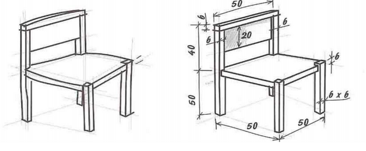

# 4. REPRESENTACIÓ D'OBJECTES

## 4.1.Representació a mà alçada

És la primera aproximació gràfica a la forma que donem a l'objecte. Els únics estris de dibuix que utilitzarem seran el llapis i la goma d'esborrar. Quan es fa un dibuix a mà alçada d'un objecte cal tenir en compte les seves proporcions , és a dir, les seves mides.

- ESBÓS Quan el dibuix es limita a reproduir vagament els trets o característiques principals d'un
objecte.

- CROQUIS Quan el dibuix és més detallat i conté informació completa de la forma i les
dimensions que té, així com tots les dades necessàries per dibuixar el plànol definitiu.

## 4.2.Representació amb estris de dibuix

Per representar amb major exactitud un objecte, hem de recórrer als estris de dibuix: el regle,
l'escaire, cartabó, compàs, etc.

- PLÀNOL: És el dibuix d'un objecte en el qual hi ha informació completa sobre la forma i la mida
que té, com també totes les dades necessàries per fabricar-lo.

## 4.3. Vistes principals

Les vistes principals són un tipus de representació que pertany al dibuix tècnic (sistema dièdric).

Les vistes principals que veurem en aquest nivell són tres:

- L'alçat
- La planta
- El perfil esquerre.

Per tal de poder dibuixar les vistes necessitem les seves mides, l'escala de dibuix i el punt de
vista.

- El punt de vista és el punt des del qual l'observador veu l'objecte i enfront de l'observador la vista que té és l'**alçat**.
- Per tal de dibuixar l'alçat l'observador haurà de desplaçar-se damunt de l'objecte i la vista que obtingui correspondrà a la **planta**.
- Finalment per tal de dibuixar el **perfil**, l'observador situat davant de l'alçat s'haurà de desplaçar al costat esquerre de l'objecte des d'on podrà observar la vista lateral esquerra que correspon al perfil.

S'ha de dividir el paper en quatre quadrants.

### Alineació entre les vistes

Les vistes han d’estar alineades:

- L'alçat amb el perfil.
- L'alçat amb la planta.

Per això dibuixem línies auxiliars discontinues entre les diferents vistes.

Aquesta alineació sempre ha d’existir.
