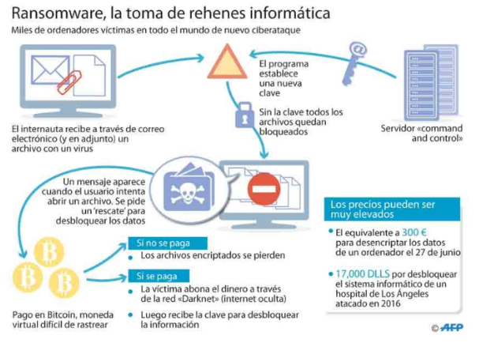

# Ransomware

El ransomware es un tipo de malware que toma a sus archivos como rehenes.

Lanzado en septiembre de 2013, CryptoLocker se extendió a través de archivos adjuntos de correo electrónico y:

- Cifró los archivos del usuario para que no pudieran acceder a ellos.
- Luego, los piratas informáticos envían supuestamente una clave de descifrado a cambio de una suma de dinero.

