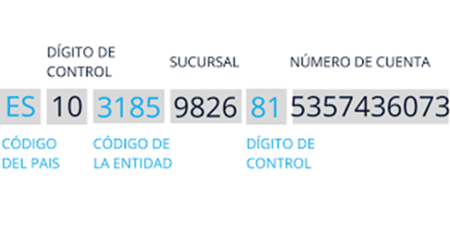

# 6.6. Curiosidades

## DNI y la letra

La letra del DNI se calcula utilizando el algoritmo de Luhn. 

1. El número de DNI se divide entre 23. 
2. El resto de la división se convierte en número, usando la siguiente tabla: 

0=T, 1=R, 2=W, 3=A, 4=G, 5=M, 6=Y, 7=F, 8=P, 9=D, 10=X, 11=B, 12=N, 13=J, 14=Z, 15=S, 16=Q, 17=V, 18=H, 19=L, 20=C, 21=K, 22=E. 

3. Si el número de DNI es 12345678 y el resto de la división es 3, la letra correspondiente es A.

## Cuentas bancarias

- El **banco** con el código de entidad 3185 es el Banco de Crédito de España.
- La **sucursal** es la de Calle Alcalá, 9826, 28027 Madrid

