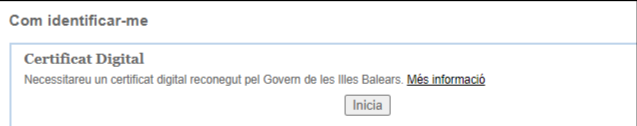

# 7.1. certificado digital

Para poder realizar firma electrónica necesitamos tener un **certificado digital**. Este certificado es el que acredita nuestra identidad en Internet.

Estos certificados se pueden conseguir de varias formas:

- El propio DNI electrónico contiene un certificado digital que podemos utilizar.
- Algunos organismos como la FNMT (Fábrica Nacional de Moneda) también nos pueden hacer un certificado digital.

 El certificado autentica, mediante una pareja de claves en un fichero software o en tarjeta la identidad del firmante.

## Autoridades de certificación

Estos certificados, son emitidos por una entidad emisora de certificados que **dan fe de que el portador del certificado es quien dice ser**.

Existen varias autoridades de certificación:

- FNMT
- Agencia de Tecnología y Certificación Electrónica de la Generalitat Valenciana
- Agència Catalana de Certificació
- Dirección General de la Policía (para el DNI), etc.

## Tipos de certificados

Las entidades certificadoras expiden distintos tipos de certificados, dependiendo de si el solicitante es:

- Un ciudadano
- Un representante de una empresa (persona jurídica, de entidad sin personalidad jurídica y, para administradores únicos y solidarios)
- Un empleado público

Si disponemos de un certificado y quieres comprobar su validez, firmar, visualizar o validar una firma puedes utilizar los servicios del portal de firma electrónica.

## ¿Cómo conseguir un certificado digital?

En caso de no contar con un certificado electrónico, el primer paso será **solicitarlo**. Los pasos que hay que seguir para realizar dicha solicitud son los siguientes:

1. Realizar una solicitud online. Al final de este proceso se obtiene un código que será necesario para poder acreditar tu identidad.
2. Presentarse en una Oficina de Registro para acreditar tu identidad.
   - Para el DNI tendrás que personarte en las oficinas de la D. G. de la Policía
   - Si solicitas un certificado de representante de una empresa, además debes acreditar la existencia de la entidad, que tienes el poder de representación y su vigencia. 
   - La Agencia Tributaria actúa como Oficina de Registro de los certificados emitidos por la FNMT. También hay Oficinas de Registro en la Comisión Nacional del Mercado de Valores o en la Comunidad Foral de Navarra. Puedes buscar la Oficina de Registro para acreditar tu identidad en el mapa de la FNMT-RCM.
3. Descargar el Certificado. Para ello, habrá sido necesario realizar el registro presencial y estar en posesión del código obtenido en el primer paso que permitirá descargar el certificado vía Internet.

