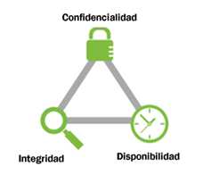

# 1.1. Principios de la seguridad informática

**Integridad:** Un sistema informático es íntegro cuando impide la modificación de la información a cualquier usuario que no haya sido autorizado con anterioridad.

Ejemplos:

- Alteración malintencionada de archivos
- Modificación de informes de ventas (empleados)

**Confidencialidad:** Un sistema informático es confidencial cuando impide la visualización de datos a los usuarios que no tengan privilegios en el sistema.

Ejemplos:

- Robo de información confidencial por parte de un atacante a través de internet
- Divulgación no autorizada a través de las redes sociales de información confidencial
- Acceso por parte de un empleado a información crítica de la compañía ubicada en carpetas sin permisos asignados, a la que no debería tener acceso

**Disponibilidad:** Un sistema informático es disponible cuando está en todo momento en funcionamiento y accesible para que los usuarios autorizados puedan hacer un uso adecuado de ellos.

Ejemplos:

- Imposibilidad de acceder al correo electrónico corporativo
- Ataque de denegación de servicio, en el que el sistema «cae»impidiendo accesos legítimos.

