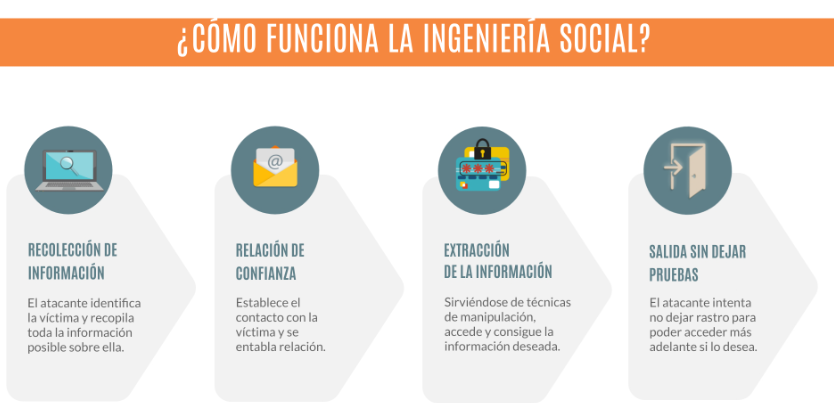

# 4.4. Ingeniería social

Los **eslabones** más **débiles** de cualquier cadena de seguridad son los seres humanos. La ingeniería social busca explotar este punto débil, apelando a la vanidad, la avaricia, la curiosidad, el altruismo o el respeto o temor a la autoridad de las personas, para conseguir que revele cierta información o que permita el acceso a un sistema informático.

Hay una serie de técnicas de ingeniería social que los ladrones utilizan. Incluyen:

- Cebos (ofrecerle algo que desea para conseguir que descargue un archivo malicioso), 
- Phishing (un correo electrónico fraudulento para que comparta información personal)
- Pretextos (hacerse pasar por otra persona con el fin de obtener acceso a información privilegiada)
- Scareware (engañarle para que crea que su equipo está infectado con malware y luego ofrecer una solución que infecta el ordenador).

