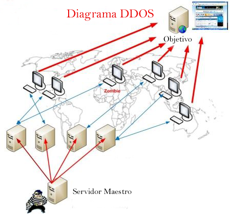

## 4.6 DDoS: denegación de servicio distribuido

Los ataques DDoS **bloquean** sitios web o redes completas **saturándolos con tráfico** de miles de equipos infectados, lo que se conoce como una botnet.

**¿A quién afectan principalmente?**

Los ataques DDoS no suelen estar dirigidos a usuarios individuales, sino a servidores web relevantes como los de bancos, pasarelas de pago con tarjeta de crédito o sitios web de organismos públicos. 

Los bancos, los sitios web de noticias e incluso de instituciones públicas son el principal objetivo de este tipo de ataques, que impiden que los usuarios puedan acceder a ellos.

**¿cómo se ven afectados los usuarios?**

Dado que tanto el objetivo como los equipos utilizados en la botnet son víctimas, los usuarios individuales reciben daños colaterales en el ataque, ya sus equipos se ralentizan y fallan mientras se encuentran bajo el control del hacker.

Los motivos que llevan a un hacker a organizar un ataque DDoS suelen ser:

- El beneficio económico
- La venganza
- El deseo de ser un "troll"

El ataque hace que se cierre el sitio web y que sus servicios en línea dejen de estar disponibles para los usuarios, que suelen perder la paciencia y la confianza en la empresa, terminando por buscar otras opciones empresariales alternativas. Además de la consecuente **pérdida de ingresos**, esto produce un daño importante en la **reputación** de la organización.

Diagrama de un ataque DDos:

