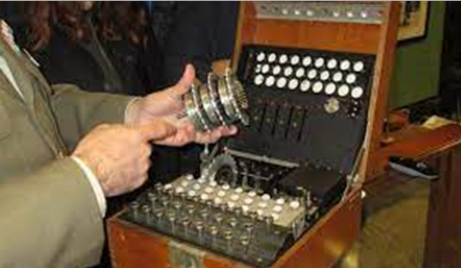

# Máquinas de cifrado - Enigma

Es en la Segunda Guerra Mundial cuando se hace imprescindible el uso de máquinas que cifren los mensajes para así evitar que el enemigo interceptase información sensible para el desarrollo de las operaciones.

