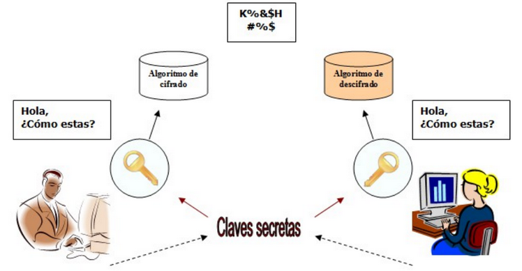

# Criptografía simétrica

La criptografía simétrica usa la misma clave para cifrar y descifrar mensajes. 

Dado que toda la seguridad recae en la clave, esta debe ser muy difícil de adivinar, para ello se usa la longitud y el conjunto de caracteres que use.

Ejercicio: [encriptacion AES](https://aesencryption.net/)
