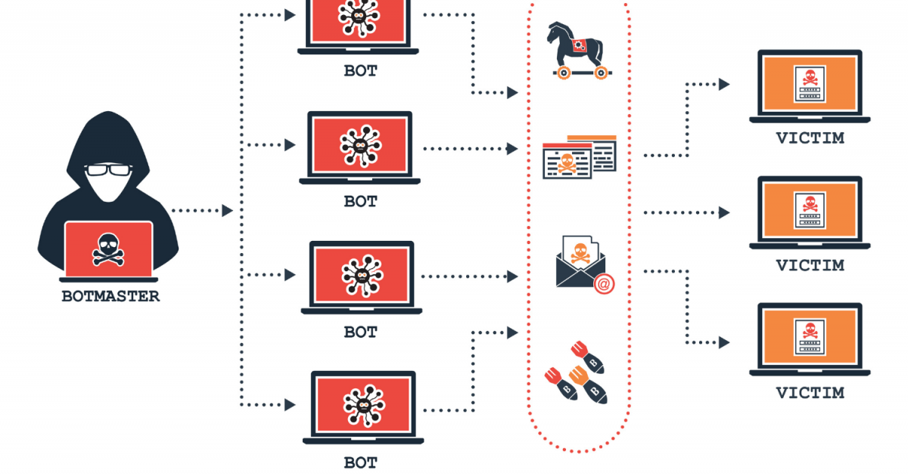

# 4.3. Botnets

Una botnet, o mejor dicho, una red de bots (también conocida como ejército zombi) es una red constituida por un gran número de equipos informáticos que han sido "secuestrados" por malware, de forma que quedan a disposición de un hacker. Al tomar el control de cientos o miles de equipos, las botnets se suelen utilizar para enviar spam o virus, para robar información personal o para realizar ataques de denegación de servicio distribuido (DDoS). A día de hoy, se consideran una de las mayores amenazas en Internet.
Botnet

Para que un equipo forme parte de una botnet, primero es necesario que se **infecte** con algún tipo de **malware** que se comunica con un servidor remoto o con otros equipos infectados de la red. De esta forma, recibe instrucciones de quien controla la botnet, normalmente hackers y ciberdelincuentes.

