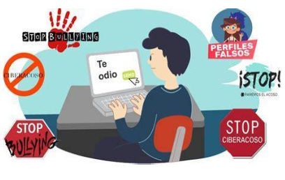

# 4.5. Ciberacoso

El ciberacoso puede ser el tipo de ataque en línea más pernicioso, ya que los acosadores, que suelen **ocultarse** tras personalidades falsas, tienden a aprovecharse de las **inseguridades** o **debilidades** personales de la víctima para humillarla y causarle daños **psicológicos**.

El ciberacoso suele consistir en:

- El envío de mensajes amenazantes.
- La publicación de fotografías o vídeos humillantes de la víctima en redes sociales.

En ocasiones, incluso se crean páginas web sobre la víctima. Como a menudo vemos en los periódicos, el efecto del ciberacoso puede ser devastador y, en ocasiones, incluso mortal.

**¿De dónde proviene el ciberacoso?**

El ciberacoso lo practica la misma gente indeseable que acosa en la vida real. Personas que quieren **abusar de su poder** y elevar su **status** en las redes sociales **denigrando** y **humillando** a otros, especialmente si consideran que la otra persona es más débil o creen que puede representar una amenaza.

Los ciberacosadores pueden:

- Realizar publicaciones anónimas
- Esconderse tras identidades falsas
- Utilizar su identidad real sabiendo que no se van a enfrentar cara a cara con sus víctimas.

Muchos de ellos dicen o publican cosas en línea que jamás se atreverían a decir en la vida real.

