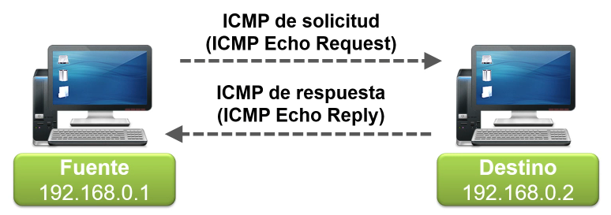

# 4.6 DDoS: denegación de servicio distribuido

Los ataques de denegación de servicio (DoS) **bloquean** sitios web o redes completas **saturándolos con tráfico**.
- Causa que un servicio o recurso sea inaccesible a usuarios legítimos.
- El atacante sobrecarga diferentes tipos de recursos como CPU, memoria, almacenamiento o recursos de la red.

**¿cómo se ven afectados los usuarios?**

Dado que tanto el objetivo como los equipos utilizados en la botnet son víctimas, los usuarios individuales reciben daños colaterales en el ataque, ya sus equipos se ralentizan y fallan mientras se encuentran bajo el control del hacker.

Los motivos que llevan a un hacker a organizar un ataque DDoS suelen ser:

- El beneficio económico
- La venganza
- El deseo de ser un "troll"

El ataque hace que se cierre el sitio web y que sus servicios en línea dejen de estar disponibles para los usuarios, que suelen perder la paciencia y la confianza en la empresa, terminando por buscar otras opciones empresariales alternativas. Además de la consecuente **pérdida de ingresos**, esto produce un daño importante en la **reputación** de la organización.

## Denegación de servicios DoS

## DDoS (DoS distrobuido)

## Ataques de reflexión y amplificación

## Ataques de reflexión

## Ataque de amplificación

## Ping

