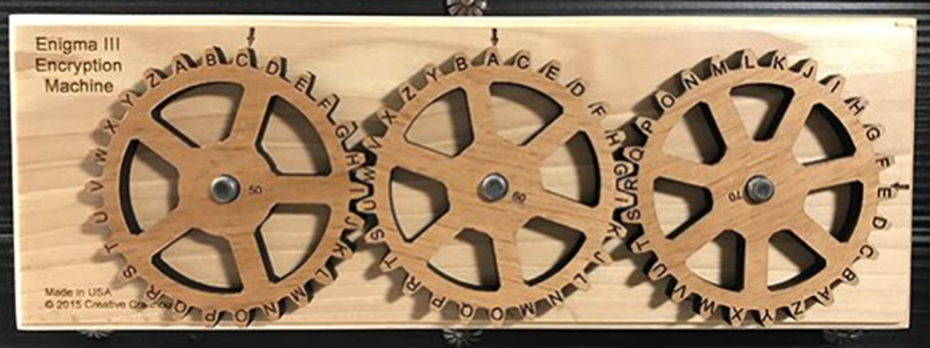

# 6.2. Máquinas de cifrado - Enigma

Es en la Segunda Guerra Mundial cuando se hace imprescindible el uso de máquinas que cifren los mensajes para así evitar que el enemigo interceptase información sensible para el desarrollo de las operaciones.

La Máquina Enigma era un dispositivo electromecánico usado para cifrar y descifrar mensajes. Estaba compuesta por un teclado, un panel de lámparas, una unidad reflectora, una unidad de rotores y una unidad de conexión.

## Sistema de engranajes

El proceso de codificación comenzaba cuando el usuario tecleaba un mensaje en el teclado. Esto producía una serie de pulsos eléctricos que viajaban a través de los cables conectados al panel de lámparas. Estas luces correspondían a las letras del mensaje en clave.

Los pulsos eléctricos también viajaban a la unidad reflectora, que los desviaba y los enviaba a la unidad de rotores. Esta unidad contenía una serie de ruedas de conexión codificadas con diferentes letras. Estas ruedas se giraban automáticamente a medida que los pulsos eléctricos pasaban a través de ellas, produciendo una nueva secuencia de letras codificadas que se enviaba de vuelta al panel de lámparas.

Finalmente, los pulsos eléctricos viajaban a la unidad de conexión, que los convertía en una secuencia de letras clave que el usuario podía leer. Esta era la forma en que la Máquina Enigma funcionaba para codificar un mensaje.

## Compartición de claves

## Simulador

https://www.101computing.net/enigma-machine-emulator/
