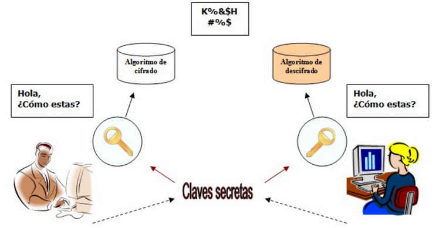

# 6.3. Criptografía simétrica

La criptografía simétrica, también conocida como criptografía de clave privada, se utiliza la misma clave para cifrar y descifrar un mensaje. 

Esto significa que el remitente y el receptor de un mensaje deben **compartir** la misma **clave** de antemano.

## Usos

La criptografía simétrica suele utilizarse para proteger las comunicaciones entre dos partes. También se puede usar para almacenar datos, como contraseñas, de forma que solo sea accesible para aquellos con la clave.

## Inconvenientes

Un inconveniente de la criptografía simétrica es que, si se pierde o se roba la clave, los datos que protegía también pueden hacerlo. Otra es que puede ser difícil administrar la distribución de claves a varias partes.

# Ejemplo: AES

AES es un tipo de cifrado que se usa para proteger información. El cifrado AES usa una clave que tiene 16, 24 o 32 bytes de largo. La clave se usa para cifrar y descifrar datos. 

El cifrado AES es un proceso de dos pasos. En primer lugar, se cifran los datos usando una clave. Luego, los datos se descifran usando la misma clave.

Ejercicio: [encriptacion AES](https://aesencryption.net/)
