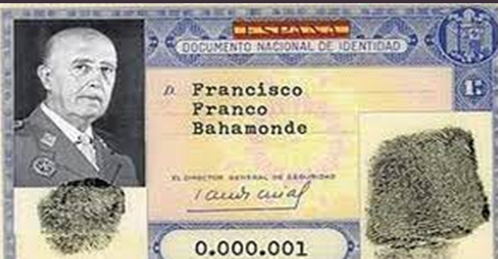
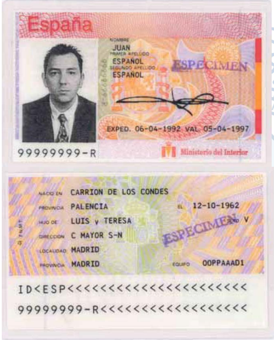

# DNI Electrónico

## Introducción y curiosidades

Hay que remontarse hasta el año 1944 -en plena época franquista y en los últimos coletazos de la Segunda Guerra Mundial- para conocer el origen de este documento.

Entró en funcionamiento un 2 de marzo: los primeros documentos de identidad no portaban fotografías y, por tanto, resultaba complejo reconocer y dar con algunas personas.

Los tres primeros números le correspondieron a Franco y su familia

Del 10 al 99, reservados para miembros de la Casa Real. Además, no existe el número 13 en los DNIs -por superstición.

## Primer DNI informatizado

El primer DNI informatizado regulado por Orden del ministerio del Interior de fecha
12 de julio de 1990.

No figura impresión dactilar y si dos líneas de caracteres OCR.

## Primer DNI electrónico

Primer DNI que incorpora CHIP, convirtiendo al Documento Nacional de Identidad en un
documento electrónico.

Se trata además de una tarjeta de policarbonato grabada con láser, con las mismas medidas que una tarjeta de crédito convencional.

Permite la conexión a servicios telemáticos, a través de un lector de tarjetas conectado al ordenador.

## Máquina para crear DNI

## DNIe

__El DNIe es el carnet de identidad de siempre\, con un chip incluido en su interior\. Este chip guarda información nuestra que nos permite utilizarlo también para autenticarnos en Internet\. __

## ¿Qué podemos hacer con el DNIe?

Este DNI aparece el 2006 y se fabrica hasta el 2015.

El DNIe me permite:

1. Acreditar electrónicamente identidad
2. Firmar digitalmente documentos electrónicos

## ¿Qué información contiene el chip?

El chip integrado contiene la siguiente información nuestra:

- Datos personales
- Fotografía
- Firma digitalizada
- Huella dactilar
- Certificados de autenticación y firma electrónica

## DNI 3.0

El DNI 3\.0\. nació en enero del 2015

Incorpora las mayores y más sofisticadas medidas de seguridad que hacen virtualmente imposible su falsificación\.

Disponer de un chip dual\-interface que permite su utilización con contacto y también modo contactless \(NFC\)

Elimina la necesidad de un lector de tarjetas o drivers\, facilitando la conexión online y la autenticación del ciudadano\.

_[https://www\.dnielectronico\.es/PDFs/Historia\_de\_los\_documentos\_de\_identidad\.pdf](https://www.dnielectronico.es/PDFs/Historia_de_los_documentos_de_identidad.pdf)_

## DNIe

Para poder utilizarlo necesitaremos un PIN que nos proporcionarán en la DGP\. Si lo olvidamos\, tendremos que ir presencialmente a conseguir otro\.

También necesitaremos:

- Lector de tarjetas
- Software de acceso a la tarjeta

## PIN

El PIN es la contraseña personal que cada DNI electrónico tiene asociado\. Se nos entrega en el momento de expedición del DNIe\, en un sobre sellado\.

No podemos cambiar el PIN por Internet\. Si que queremos es modificar nuestro PIN o incluso obtenerlo de nuevo en  __Puntos de Actualización del DNI \(PAD\)\.__  No es necesario que pidamos cita previa

Podremos hacerlo nosotros mismos a través de las máquinas que se encuentran a disposición de los ciudadanos

## ¿Qué podemos hacer?

- Consultar datos personales
- Vida laboral
- Puntos tráfico
- Empadronamiento
- Trámites
- Declaración renta
- Pago tasas
- Desempleo
- Servicios con empresas
- Banca online
- Firma de contratos

## Pagar tasas o impuestos

El DNIe o el certificado electrónico nos permiten también pagar tasas \(por ejemplo\, para que nos den un título o certificado de estudios\) o impuestos\.

En Baleares\, existe la Agencia Tributària o  __Atib__  donde podemos pagar nuestros impuestos\, tanto presencialmente en sus oficinas como online a través de su  __sede electrónica__ \.

## Lectores

__Los tipos de lectores más habituales son:__

- Lector USB conectado a un ordenador
- Teclado especial con lector integrado
- Smartphone mediante la tecnología NFC
- La necesidad de tener este hardware ha sido uno de los principales problemas a la hora de implantar el DNI electrónico

_[https://www\.youtube\.com/watch?v=kTC\-xxdTufA](https://www.youtube.com/watch?v=kTC-xxdTufA)_

## Partes DNIe

