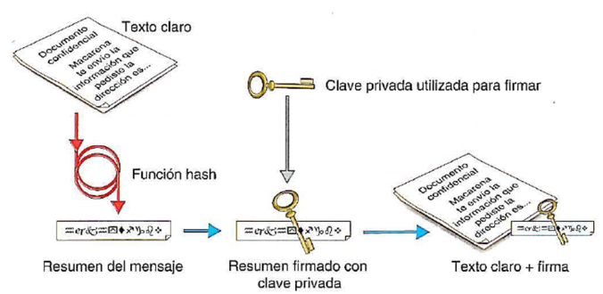

# Firma digital

La firma digital viene a sustituir a la manuscrita en el mundo de la informática. Es decir, si firmamos de forma digital un documenta, le estaremos dando veracidad y como sucede con la firma manuscrita, no podremos decir que no lo hemos firmado nosotras; por lo tanto, seremos responsables de lo que en él se diga.

## ¿Para qué sirve la firma electrónica?

La firma digital viene a sustituir a la manuscrita en el mundo de la informática\.

- Si firmamos de forma digital un documento\, le estaremos dando  __veracidad__
- No podremos decir que no lo hemos firmado nosotros
- Seremos responsables de lo que en él se diga\.

Una firma electrónica es un conjunto de datos electrónicos que:

- Se adjuntan a un documento electrónico determinado
- Identifican al firmante de manera inequívoca
- Certifican la integridad del documento
- Aseguran que el firmante no puede repudiar lo firmado\.

## Mecanismo

La descripción del mecanismo de firma electrónica es el siguiente:

1. Se calcula un valor resumen del documento\, utilizando algún algoritmo como el  __SHA__ \.
2. Este valor resumen se cifra utilizando nuestra **clave privada**.
3. El resultado de este valor es lo que se conoce como firma digital del documento\.

Esto permite asegurar que la única persona que ha podido firmar el documento soy yo\, el único que conoce la clave privada.

## Firma de documentos electrónicos

Si contamos con un **certificado digital**, podemos comenzar a firmar documentos. La firma electrónica en documentos se puede realizar de dos formas:

- Online, a través de un servicio de verificación y generación de firmas electrónicas como es VALIDe
- A través de aplicaciones de firma electrónica o de ofimática que, tras ser descargadas y ejecutadas en un ordenador, permitirán realizar firmas de documentación sin la necesidad de estar conectado a Internet.

## Sellado en el tiempo

Una de las características más útiles que puede ir asociada a la firma electrónica es lo que se conoce como "sellado en el tiempo"\. Se trata de un método para probar que un conjunto de datos \(en este caso\, la firma que se ha realizado\) existió en un momento determinado \(fecha y hora\)\.

