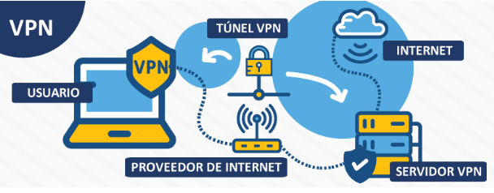

# Redes privadas virtuales

Consiste en conectarse a Internet a través de una red privada, estableciendo una conexión cifrada y así evita que el buscador guarde tus datos.

- VPN de acceso remoto: acceso a una red privada con una red pública. Ejemplos son conexiones desde lugares públicos como hoteles o cafeterías.
- VPN de sitio a sitio: conectar redes a través de internet, pudiendo comunicarse entre ellas.

## Algunas ventajas de utilizar una VPN

- Acceder a contenido global
- Algunos contenidos solo están disponibles en determinadas regiones. Una VPN cambia su ubicación virtual para que pueda verla en cualquier lugar.

Evite la censura local

Algunos gobiernos bloquean aplicaciones y sitios web populares. Una VPN los desbloquea cambiando su ubicación virtual.

Proteja su privacidad en línea
Los propietarios de redes y los proveedores de Internet pueden ver todo lo que hace en línea. Con una VPN activado, no pueden ver nada.

## Evitar el seguimiento basado en IP

Los servicios publicitarios utilizan su dirección IP para rastrear su comportamiento en todos los sitios. Las VPN los detiene asignándole una nueva IP.
Juega en nuevos servidores de juegos, evita la aceleración y desbloquea aplicaciones y sitios web en las redes de la escuela y el trabajo.
