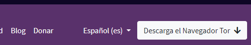
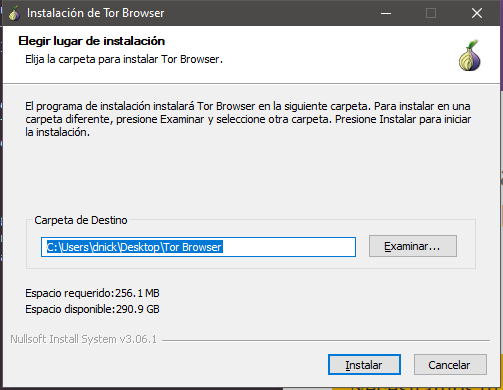
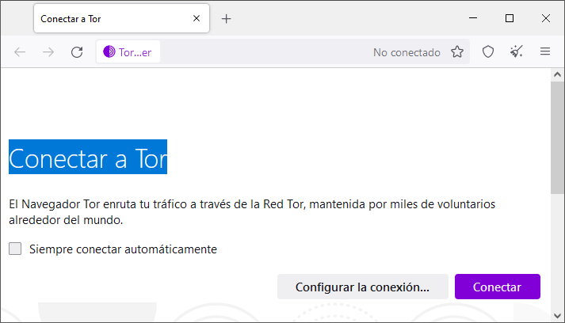
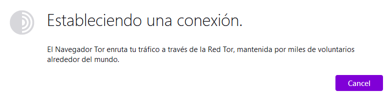
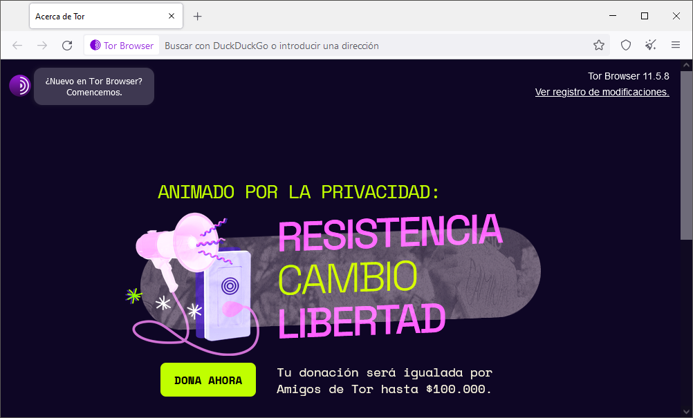

# 5. Ejecutar TOR

## Configuración

El primer paso es descargar e instalar el Navegador Tor. Esta es una versión especial del navegador Firefox diseñada específicamente para usar Tor. Se puede descargar desde el sitio web del Proyecto Tor. 

[ Web del proyecto TOR](https://www.torproject.org/es/download/)

Una vez que se complete la descarga, haga doble clic en el archivo ejecutable para comenzar el proceso de instalación. Cuando se le solicite, elija una ubicación de instalación y haga clic en "Instalar".

Una vez que se complete la instalación, inicie el navegador Tor. Se le pedirá que haga clic en "Conectar" para conectarse a la red Tor. 

Cuando se establezca la conexión, se le presentará una ventana que muestra su dirección IP actual. Esta es la dirección IP que será visible para los sitios web que visites mientras usas el Navegador Tor.

## Acceso a sitios

Principalmente la Dark Web suele formarse por páginas que con unos **enlaces** muy particulares a través de dominios propios como las **.onion** de TOR o las **.i2p** de los eepsites de I2P, pero a las que no puedes acceder a no ser que tengas el software necesario para navegar por las Darknets en las que se alojan.

Algunos sitios son accesibles desde la Clearnet, como Onion City, capaces de indexar miles de páginas .onion. También existen otros buscadores dentro de las propias Darknets como not Evil, Torch o una versión de DuckDuckGo también hacen lo mismo. 

Además, otras herramientas como **Onion.to** permiten acceder a las Dark Webs de TOR con sólo añadir la terminación .to, al dominio **.onion**, de manera que la web luzca como tupagina.onion.to.

Ahora que el navegador Tor está instalado y conectado a la red Tor, puede comenzar a acceder a los sitios de cebolla. Los sitios Onion se pueden encontrar buscando en la web o a través de directorios como:

-  The Hidden Wiki 
-  OnionDir
  
Una vez que haya localizado un sitio que le gustaría visitar, copie la URL y péguela en la barra de direcciones del navegador Tor.

Cuando visite un sitio de cebolla, se le presentará una página de advertencia. Esta página tiene como objetivo alertarlo sobre el hecho de que está accediendo a un sitio en la red Tor y que su actividad de navegación puede ser monitoreada. Haga clic en "Aceptar" para acceder al sitio web.

## Conclusión

El uso de Tor y los sitios de cebolla es una excelente manera de navegar por la web **de forma anónima y segura**. Con el Navegador Tor instalado y conectado a la red Tor, puede acceder a los sitios de cebolla rápida y fácilmente. Solo recuerde estar siempre al tanto de los riesgos asociados con la navegación web en la red Tor y tenga cuidado al visitar los sitios.