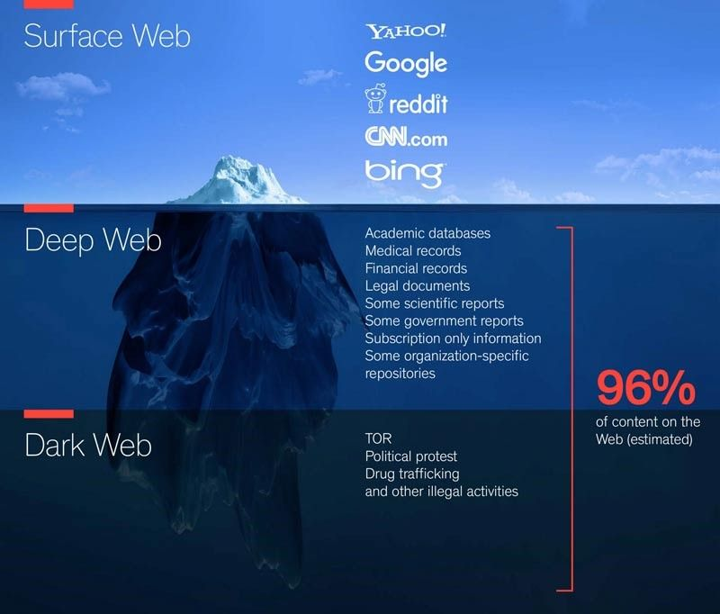

# Las capas de la web. Clearnet, deep web y dark web

## ¿Qué es la web?

- Internet tiene varias capas
- Nosotros navegamos una capa que nos permite ver internet  como algo interactivo y entender el lenguaje que hablan las máquinas, que son las páginas web o los servicios que vemos nosotros a través de internet
- Navegadores nos lo ponen todo muy bonito para que veamos las páginas web, para que veamos los servicios como los vemos


Las 3 capas de la web



- WEB SUPERFICIAL
- DEEP WEB
- DARK WEB

## Clearnet o web superficial

- Nosotros cuando navegamos habitualmente en internet a través de un navegador cómo puede ser Chrome, Internet Explorer, Firefox, etc.
- Nosotros podemos ver lo que se llama la web superficial.
- Todos estos servicios que nosotros navegamos habitualmente  y que consumimos, esta información es la web superficial
- Google indexa todo esto, recoge todo el contenido que existe en esta web superficial 
- Redes sociales, aplicaciones, medios de comunicación, donde trabajan los navegadores habituales.

## Deep web

- Se traduce como “web profunda” o “web invisible” 
- Toda información en el Internet que no se encuentra indexada en los motores de búsqueda tradicionales:  Google, Yahoo, Bing, entre otros.
- Contenido de tu Google Drive
- Intranets empresariales y académicos
- Registros de casos judiciales
- Contenido privado de las redes sociales 
- Páginas de gobiernos

## Dark web

La Dark Web no es accesible desde un navegador tradicional, o al menos no sin una configuración especial. 
No pondrás un enlace en la barra de direcciones y accederás al Dark Web así sin más.

## ¿Cómo surge la dark web?

- proyecto militar que se utilizaba para compartir archivos  e información
- Funcionaba en otra capa, no en la capa que nosotros vemos, con otro navegador diferente
- Lo diseñaron así para que fuera anónimo y para que pudieran, al tener unos fines militares de tal modo que esta información pudiera viajar de forma más segura.


## Dark web

- La darknet funciona  en otra capa distinta
- Necesita un navegador diferente  (Tor)
- Logotipo de una cebolla
- Páginas terminan en .onion
- Tor traduce y lo que permite indexar y ver estas páginas que están en esta red
- Esto tenía unos fines militares hace muchos años.


## ¿Por qué es más segura?

- Cuando consultamos nuestras páginas web, vamos dejando un rastro técnico.
- La dirección IP se puede rastrear
- En TOR, esta IP se oculta
- Comunicación pasa por varios nodos


Navegación aparentemente anónima

## TOR

- Inicialmente convivieron dos mundos
- La web superficial que conocemos (rastreable)
- La dark web (más difícil de rastrear y anónima)
- Los usos militares dejaron de darse
- Se liberó esta capa para uso común 

Muchas personas pensaron: 

```
"Pues genial, tenemos una capa en internet diferente donde podemos publicar información,  podemos comunicarnos de forma aparentemente anónima y, además, difícil de rastrear".
```

## ¿Qué te puede ocurrir?

- Aprovecharon estas páginas web  y esta capa diferente para publicar o vender todo tipo de cosas ilícitas.
- Si tú navegas por internet no pasa nada, puedes ver lo que hay y comprobarlo.
- El problema es comprar, vender o prestarse a mercadear con este tipo de servicios
- Hay muchos estafadores (la mayoría)

## Aspectos positivos

- Es positiva porque te permite navegar de forma anónima. Debido a que no pueden rastrear la IP. 
- También es un navegador que te permite también acceder a la web superficial, pero escondiendo tu dirección IP.
- La navegación es lenta, a menos que lo necesite para navegar de forma anónima,  que puede utilizar otro tipos de sistemas de navegación.

## ¿Quién usa TOR?

- El principal objetivo de Tor es proteger la privacidad de sus usuarios, es por esto que lo usan los que les preocupa proteger la privacidad. 
- La gente normal usa Tor para navegar sin dejar rastros de navegación. 

## ¿Quién usa TOR?

- Usuarios que viven en países que censuran contenido usan Tor para navegar sin restricciones. 
- Los periodistas usan Tor para compartir información y proteger la confidencialidad de la navegación por Internet. 
- Los agentes del orden usan Tor para llevar a cabo investigaciones enmascarando su rastro
- Los activistas y denunciantes utilizan Tor para proteger su identidad de los que censuran la libertad. 
- Muchas personas más usan Tor de manera cotidiana para sus actividades en línea

