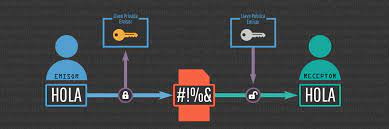

# 6.1. Criptografía

La **criptografía** (del griego 'escritura oculta') es la ciencia de cifrar y descifrar información con técnicas especiales, usado frecuentemente en mensajes que solo puedan ser leídos por las personas a las que van dirigidos.

Al hablar de este área se debería hablar de criptologia que a su vez engloba:

- Las técnicas de cifrado (**criptografía**)
- Sus técnicas complementarias donde se incluye el **criptoanalisis** (técnica que estudia los métodos para romper textos cifrados con objeto de recuperar la información original en ausencia de claves).

- [Práctica tipos de cifrado](https://cryptii.com/pipes/caesar-cipher)

## Terminologia

- El mensaje original recibe el nombre de texto claro.
- El mensaje codificado se denomina texto cifrado.
- El proceso de convertir el texto claro en texto cifrado se denomina cifrado.
- El proceso de recuperar el texto claro a partir del texto cifrado se denomina descifrado.

