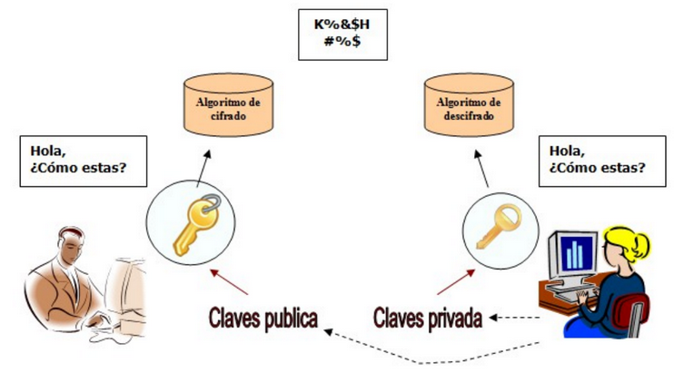
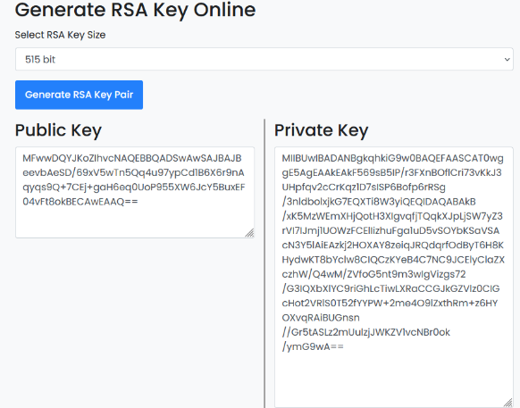
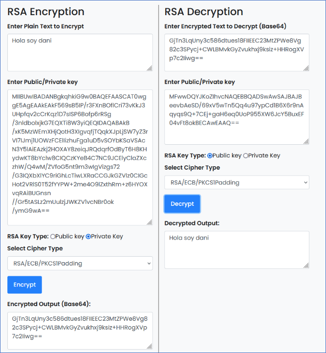

# 6.4. Criptografía asimétrica o de clave pública

En la criptografía asimétrica tenemos, en lugar de única clave compartida por el emisor y el receptor, 2 claves por cada persona.

.png)

## ¿Qué claves se necesitan?

Cada usuario del sistema criptográfico ha de poseer una pareja de claves, formada por:

- Una **Clave privada**, que será custodiada por su propietario y no se dará a conocer a ningún otro.
- Una **Clave publica**, que será conocida por todos los usuarios.

## ¿Qué relación tienen estas 2 claves?

Esta pareja de claves es **complementaria**: lo que cifra una solo lo puede descifrar la otra y viceversa.

Como es lógico pensar, estas claves se generan a la vez y se encuentran relacionadas matemáticamente entre sí mediante funciones de un solo sentido.

Resulta prácticamente imposible descubrir la clave privada a partir de la pública

## Algoritmo RSA

RSA es un algoritmo de cifrado basado en la teoría de los números primos. Se utiliza en la mayoría de los sistemas de cifrado de datos, como SSL/TLS, para proporcionar una capa de seguridad adicional.

Práctica: https://www.devglan.com/online-tools/rsa-encryption-decryption

## Generación de claves

## Encriptar con clave privada

## Webs para practicar

- https://cryptii.com/pipes/caesar-cipher
- https://cifraronline.com/
- https://www.devglan.com/online-tools/rsa-encryption-decryption