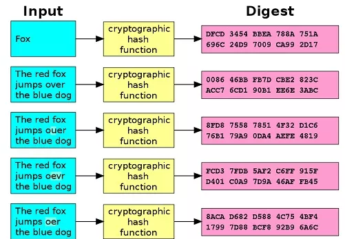

# Funciones de hash

Las funciones hash son algoritmos matemáticos que se usan para convertir datos de cualquier tamaño en una cadena de caracteres de tamaño fijo. Esto permite que los datos sean rápidamente comparados y verificados.

Son útiles para la criptografía, ya que permiten almacenar y transmitir datos de forma segura, ya que los datos cifrados se pueden verificar sin necesidad de descifrarlos.

También se usan para la **autenticación** de usuarios, ya que los usuarios pueden verificar su identidad al proporcionar una contraseña cifrada que coincida con una contraseña guardada de forma segura.

Además, se usan para detectar la **corrupción de datos**, ya que si los datos cambian, la función hash generará un valor diferente. Esto permite a los usuarios detectar cualquier cambio en los datos sin necesidad de verificarlos manualmente.

Las funciones hash también se usan para detectar la **duplicación de archivos**, ya que los archivos con contenidos idénticos generarán el mismo valor de hash.

En resumen, las funciones hash son algoritmos matemáticos que se usan para convertir datos de cualquier tamaño en una cadena de caracteres de tamaño fijo. Esto les permite a los usuarios verificar y detectar cambios en los datos de forma rápida y segura, así como detectar la duplicación de archivos.

## Ejemplo emule

El hash en este caso se genera a partir del contenido de un archivo, en bits. Solo de esta forma podemos afirmar que dos o más archivos son exactamente idénticos, puesto que:

1. Dos archivos pueden tener el **mismo nombre** pero ser distintos
3. Dos archivos pueden tener el **mismo tamaño** pero diferente contenido

Compararlos bit a bit no tiene sentido pues es computacionalmente muy costoso. Es mucho más rápido comparar sus hashes.

## Ejemplo ``Bitcoin``

El hash de un bloque nuevo se calcula a partir de 3 cosas:

- Un hash generado a partir de todas las transacciones que contendrá el bloque.
- El hash del bloque anterior
- Un nonce o número aleatorio

