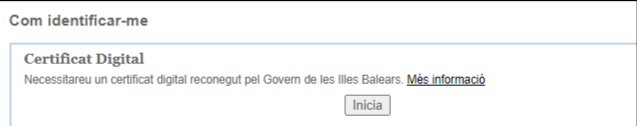
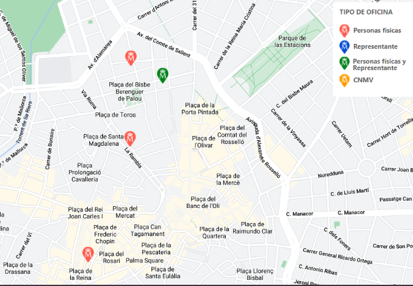

# 7.1. certificado digital

Para poder realizar firma electrónica necesitamos tener un **certificado digital**. Este certificado es el que acredita nuestra identidad en Internet.

El certificado autentica\, mediante una pareja de  __claves __ en un fichero software o en tarjeta la identidad del firmante\.

## Ejemplo de certificado electrónico

## Cómo conseguir un certificado

Estos certificados se pueden conseguir de varias formas:

- El propio DNI electrónico contiene un certificado digital que podemos utilizar.
- Algunos organismos como la FNMT (Fábrica Nacional de Moneda) también nos pueden hacer un certificado digital.

 El certificado autentica, mediante una pareja de claves en un fichero software o en tarjeta la identidad del firmante.

## Autoridades de certificación

Estos certificados, son emitidos por una entidad emisora de certificados que **dan fe de que el portador del certificado es quien dice ser**.

Existen varias autoridades de certificación:

- FNMT
- Agencia de Tecnología y Certificación Electrónica de la Generalitat Valenciana
- Agència Catalana de Certificació
- Dirección General de la Policía (para el DNI), etc.

## Tipos de certificados

Las entidades certificadoras expiden distintos tipos de certificados, dependiendo de si el solicitante es:

- Un ciudadano
- Un representante de una empresa (persona jurídica, de entidad sin personalidad jurídica y, para administradores únicos y solidarios)
- Un empleado público

Si disponemos de un certificado y quieres comprobar su validez, firmar, visualizar o validar una firma puedes utilizar los servicios del portal de firma electrónica.

## ¿Cómo conseguir un certificado digital?

Paso 1\. Realizar una solicitud online\.

- Desde el **ordenador** donde queremos instalarlo\.
- Utilizando el **navegador** que queramos\.
- Al final de este proceso se obtiene un código que será necesario para poder acreditar tu identidad\.

Paso 2\. Acreditar identidad

- Presentarse en una Oficina de Registro para acreditar tu identidad\.
- sssPara el DNI tendrás que personarte en las oficinas de la D\. G\. de la Policía

_[http://mapaoficinascert\.appspot\.com/\#](http://mapaoficinascert.appspot.com/#)_

Paso 3\. Descargar certificado

- Antes realizar el registro presencial
- Tenemos que tener del código obtenido en el primer paso
- Con esto podremos descargar el certificado vía Internet\.
- El certificado quedará instalado en ese navegador y PC utilizado

## Utilización

La mayoría de administraciones públicas tienen un portal telemático en el que realizar trámites y solicitudes, utilizando el certificado electrónico o la clave para identificarnos.

Una vez entremos, si tenemos nuestro certificado digital instalado, nos permitirá seleccionarlo (podríamos tener varios en el equipo).

