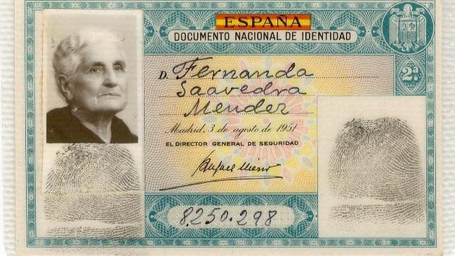

# Identidad digital

## Identificación

En nuestro día a día\, necesitamos identificarnos para acceder a servicios. Es decir\, demostrar que somos nosotros realmente.

Las formas de identificación más comunes son el DNI\, el pasaporte\, la tarjeta de crédito o el carnet de conducir. Todas estas formas sirven para poder acceder a servicios bancarios\, alojamientos\, transporte\, compras en línea\, entre otros. Además\, muchos lugares también requieren la presentación de un documento de identificación para poder acceder a ellos.

En el mundo real la verificación relacionada con

- Rasgos (aspecto físico)
- Datos (huella dactilar)
- Firmas (firma en documentos)

Pero en el mundo digital\, la autenticación se basa en otros métodos como:

- Contraseñas
- Códigos de seguridad
- Token de autenticación
- Biometría
- La autenticación de dos factores (2FA)

## HUELLA DACTILAR

Las huellas digitales son únicas, incluso para estos hermanos idénticos. Esto se debe a que las huellas dactilares no responden a la genética sino que, al formarse al tercer mes de embarazo, van variando cuando los dedos rozan con el cordón umbilical o este crece permitiendo más movimientos intrauterinos

### Firma

La firma de una persona es una forma de identificación. No es una forma válida de autenticación en sí misma, ya que no es una prueba de quién es la persona. Para ser válida, la firma debe ser autenticada por un tercero, como un notario público, y debe estar asociada con un documento legalmente vinculante.

## DNI

## Documento nacional de identidad

La forma más habitual de demostrar nuestra identidad es presentar nuestro DNI o firmar\.

La policía nos da un DNI solo a nosotros\, con nuestra huella\, foto y firma\.

Presentando este documento con nuestra foto\, demostramos que nuestros  __datos __ son los que allí figuran\.

## ¿Cómo nos identificamos en Internet?

En la actualidad, muchas de las tareas que antes se realizaban de forma presencial ahora se han trasladado al ámbito digital, ya sea por comodidad o por imposición legal. Esto conlleva una necesidad de encontrar una forma de acreditar de manera segura nuestra identidad, ya que no podemos mostrar físicamente un documento de identidad como el DNI.

__Necesitamos otros métodos\.__

## Contraseñas

La contraseña es el método más ampliamente extendido para proteger nuestros datos, permitiendo una identificación y acceso seguros a nuestra información. Aunque no es el método más seguro, hay algunos elementos clave que debemos tener en cuenta para mejorar su seguridad: utilizar contraseñas largas y complejas, incluir caracteres especiales, mayúsculas o minúsculas, cambiar la contraseña de forma regular y no utilizar la misma contraseña para varias páginas.

 Además, es conveniente contar con métodos de recuperación, como un número de teléfono o dirección alternativa, para poder recuperar el acceso si olvidamos la contraseña.

## Formas de demostrar nuestra identidad

Existen multitud de métodos de demostrar nuestra identidad digitalmente:

1. DNIe
2. Certificado digital
3. Contraseñas
4. Biometría

Algunas simplemente sirven para proteger algo\, y otras demuestran que somos una persona concreta\.
