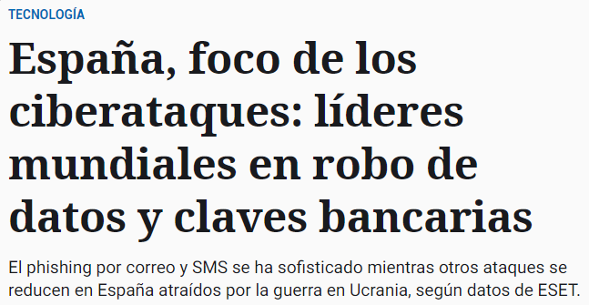

## Phishing

Es un tipo de fraude ejecutado a través de un **correo electrónico** en el que se solicita la actualización de los datos personales (usualmente vinculados a cuentas u otros instrumentos financieros).

Aparece un **enlace** para que se haga clic de acceso a una página falsa que tendrá prácticamente la **misma apariencia** de la página de la institución simulada.

## Pharming

Se instala un código malicioso introducido premeditadamente que permite **redireccionar** un nombre de dominio a otra máquina diferente.

Si el usuario ha sido redireccionado, cuando introduzca el nombre de dominio ingresará a una página ‘web’ falsa (en apariencia similar a la que deseaba ingresar) permitiéndole al estafador obtener todos los datos personales del cliente.

Finalidad:

- Obtener datos bancarios
- Cometer delitos económicos