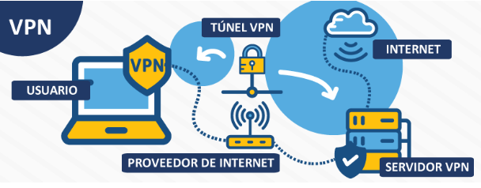

# Redes privadas virtuales

Las VPN se utilizan para proporcionar una conexión segura a una red privada a través de una red pública, como Internet. Esto se logra mediante el uso de una serie de protocolos de seguridad para crear un "túnel" seguro entre dos puntos.

Esta conexión segura ayuda a proteger la privacidad y seguridad de la información transmitida entre los puntos.

- VPN de acceso remoto: acceso a una red privada con una red pública. Ejemplos son conexiones desde lugares públicos como hoteles o cafeterías.
- VPN de sitio a sitio: conectar redes a través de internet, pudiendo comunicarse entre ellas.

## Algunas ventajas de utilizar una VPN

Una de las principales razones de la popularidad de las VPN es la seguridad que proporcionan. La encriptación de los datos y los protocolos de seguridad utilizados en una VPN aseguran que la información se mantenga segura mientras viaja a través de Internet. Esto es especialmente útil para aquellos que desean acceder a redes privadas desde su hogar u oficina.

Otra ventaja de las VPN es la capacidad de evitar las restricciones geográficas. Esto significa que los usuarios pueden acceder a contenido restringido en su país sin tener que viajar físicamente. Esto también se puede utilizar para cambiar la dirección IP de un usuario para ocultar su ubicación real.

## Inconvenientes

Sin embargo, hay algunos inconvenientes que deben tenerse en cuenta al usar una VPN. Algunos servicios de VPN pueden ser costosos. Además, a veces puede haber problemas de velocidad. Esto puede ser debido a la congestión de la red o al mal funcionamiento de los servidores VPN.
