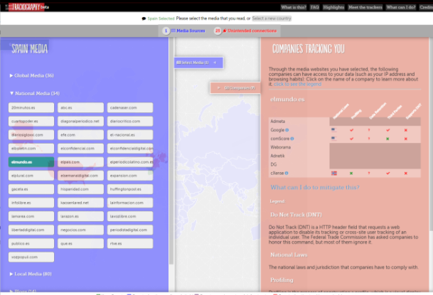

# Los rastreadores o trackers

## ¿Qué son?

Estos rastreadores se usan para monitorear la actividad de los usuarios en redes sociales, foros, blogs y otros sitios web populares. Estos rastreadores también se utilizan para recopilar y analizar datos sobre el comportamiento de los usuarios en línea para fines de marketing, investigación y seguridad. Crean un **perfil** con nuestros datos. 

## ¿Por qué siguen nuestra actividad?

El objetivo de gran parte de este seguimiento es dirigirnos a nosotros con publicidad. Los datos sobre nuestras actividades en línea se recopilan y agregan en perfiles. Estos perfiles les dicen a los rastreadores de terceros quiénes somos, qué nos interesa y predicen lo que haremos en el futuro.

# Bloqueo de rastreadores

Existen extensiones de navegador o navegadores propiamente dichos, que nos permiten bloquear a ciertos rastreadores, así como informarnos de cuestiones relacionadas con la privacidad.

En este caso, **classroom** tiene la comunicación encriptada, ningún tracker, pero prácticas de privacidad poco deseables.
Podemos ver información acerca de las prácticas que lleva a cabo este sitio web:

- Puede utilizar nuestros datos en otros productos de Google
- Nos sigue en otras páginas web
- Los logs se guardan siempre

