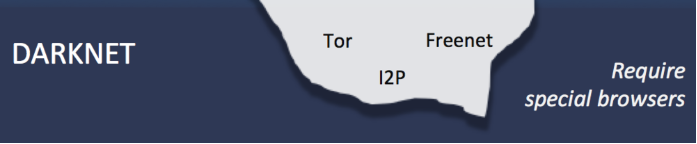

# 3. Dark web

La Dark Web no es accesible desde un navegador tradicional, o al menos no sin una configuración especial.
No pondrás un enlace en la barra de direcciones y accederás al Dark Web así sin más.

## ¿Cómo surge la dark web?

- proyecto militar que se utilizaba para compartir archivos  e información
- Funcionaba en otra capa, no en la capa que nosotros vemos, con otro navegador diferente
- Lo diseñaron así para que fuera anónimo y para que pudieran, al tener unos fines militares de tal modo que esta información pudiera viajar de forma más segura.

## ¿Cómo funciona?

- La darknet funciona  en otra capa distinta
- Necesita un navegador diferente  (Tor)
- Logotipo de una cebolla
- Páginas terminan en .onion
- Tor traduce y lo que permite indexar y ver estas páginas que están en esta red
- Esto tenía unos fines militares hace muchos años.

## ¿Por qué es más segura?

- Cuando consultamos nuestras páginas web, vamos dejando un rastro técnico.
- La dirección IP se puede rastrear
- En TOR, esta IP se oculta
- Comunicación pasa por varios nodos
- Navegación aparentemente anónima

