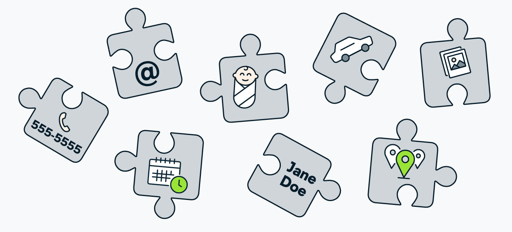

# ¿Qué es el doxxeo?

## Introducción

## Qué es el doxxeo

- Doxing es el acto de encontrar y compartir la información personal y confidencialde alguien sin su permiso.
- Tipo de ciberataque y ciberacoso en Internet
- Doxing puede ser usado para amenazar o atacar a la persona, o para chantajearla.
- Sus víctimas son mayoritariamente mujeres

# ¿Por qué lo hacen?

- Venganza
- Justicia extrajudicial

- Dañar a persona con notoriedad

- Dañar a personas con opiniones o puntos de vista opuestos

# ¿Cuales son sus propósitos?

- Intimidar a la víctima invadiendo y eliminando su privacidad
- Perpetuar el acoso distribuyendo la información para futuros acosadores

# ¿Cómo se lleva a cabo?

FASE 1

- Recopilan toda la información que puedan encontrar
- Redes sociales, páginas webs, bases de datos
- Buscan teléfonos y direcciones, pirateo de bases de datos, ataques de ingeniería social.
Objetivo: reunir toda la información posible sobre la víctima, su entorno y su vida.

FASE 2

- Difusión de información recopilada
- Todos los medios y plataformas disponibles en la Red.
- Objetivo: llegar al mayor número de personas y estas sigan difundiéndola.
- Incitación al acoso y amenazas

# ¿Cómo conseguir información?

Hay una variedad de estrategias de doxing que se pueden usar para recopilar información sobre un individuo.

Algunas estrategias comunes de doxing incluyen:

1. Búsqueda de plataformas de **redes sociales**: esto se puede hacer buscando el nombre de la persona en plataformas de redes sociales como Facebook, Twitter e Instagram. Esto a menudo puede generar información valiosa, como la información de contacto de la persona, la fecha de nacimiento y el historial laboral.

2. Realización de una **búsqueda inversa de imágenes**: esto se puede hacer cargando una imagen de la persona en un motor de búsqueda como Google Images. Esto a menudo puede ayudar a encontrar otras instancias de la imagen en línea, que pueden proporcionar información adicional sobre el individuo.

3. Búsqueda de **registros públicos**: esto se puede hacer buscando el nombre de la persona en las bases de datos de registros públicos, como las que mantiene el gobierno de los EE. UU. Esto puede proporcionar información como los antecedentes penales, los antecedentes financieros y los registros de propiedad de la persona.

4. Uso de **motores de búsqueda web**: esto se puede hacer buscando el nombre de la persona en motores de búsqueda web populares como Google y Bing. A menudo, esto puede proporcionar información como el sitio web, el blog y los perfiles de redes sociales de la persona.

5. Ponerse en contacto con la persona directamente: esto se puede hacer enviándole a la persona un correo electrónico, un mensaje instantáneo o un mensaje en las redes sociales. Esta puede ser una estrategia arriesgada, ya que la persona puede darse cuenta de que está siendo investigada.

6. Contratación de un **investigador privado:** Esto se puede hacer mediante la contratación de un investigador profesional para realizar una investigación más exhaustiva. Esta suele ser una opción más costosa, pero puede brindar más información que otras estrategias de doxing.

7. Doxing en represalia: esto implica divulgar información personal sobre alguien en represalia por haber divulgado información personal sobre usted. Esta puede ser una estrategia peligrosa, ya que puede escalar la situación y conducir a más ciberacoso.

# Peligros
Facilita identificación en mundo real / familiares
Dirección, trabajo, teléfono

# Posibles resultados

- Terminar suscrito a algún servicio o recibir pedidos no deseados
- Recibir amenazas o acosos
- Suplantación de identidad
- Swatting (denuncias falsas)

Consecuencias:

- Puede llevar al acoso y hasta las amenazas de violencia.
- Puede dañar la reputación de una persona.
- Pérdida de trabajo o expulsión de la escuela.
- Puede hacer que una persona tenga dificultades para encontrar un hogar o conseguir un préstamo.
- Puede hacer que una persona sea excluida de redes sociales y otras plataformas en línea.
- Hacer que una persona tenga dificultades para conseguir un trabajo o ingresar a la universidad.
- Pérdida de anonimato en Internet
- Información queda expuesta en la red
- Obligar a la persona a abandonar presencia en redes
- Cambiar de vivienda o trabajo

# ¿Cómo protegerse

- La mejor forma de protegerse del doxxeo es ser cuidadoso con la información que se comparte en línea.
- No publicar información personal en sitios web públicos o en redes sociales
- Tener cuidado de no revelar demasiada información en conversaciones en línea.
- No abrir enlaces sospechosos o adjuntos de correo electrónico, ya que esto podría permitir que un atacante ingrese a su sistema.
- Googlearnos.
- justdelete.me
- No reutilizar contraseñas
- Habilitar autenticación de doble factor

## Ejemplos

1. Empezamos casi por el principio de esta práctica. En 1997, activistas antiaborto de EE. UU. se hicieron con información personal de las clínicas y profesionales que llevaban a cabo esta práctica en el país, publicándola en una lista negra que estuvo colgada en Internet hasta 2002. En ella no solo se identificaba a estas personas, también si incitaba a hacerles daño.

2. Seguimos en EE. UU., pero en el año 2013; tras el atentado de la Maratón de Boston, miles de usuarios en Reddit decidieron jugar a ser policías y tratar de identificar a los responsables. Al final, lo que consiguieron fue identificar erróneamente a varios sospechosos, a los que sometieron a ataques de doxing. Ninguna de estas personas era responsable del atentado. Lo peor, es que a causa del acoso recibido, una de ellas acabó suicidándose.

3. Y para terminar, un caso más cercano y más conocido. Hablamos de la persona que difundió la imagen y los datos personales de la víctima de ‘la Manada’. Dicha difusión la llevó a cabo en redes sociales, foros y medios digitales.
