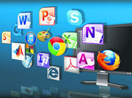
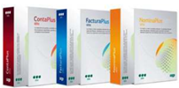
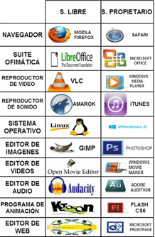
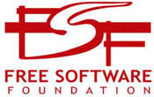
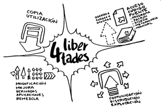

# Software

El software es la parte lógica del ordenador, formada por programas, instrucciones, reglas informáticas y datos asociados. Esta información es procesada por el ordenador para realizar tareas específicas.

## Tipos de software

Software de base
Software de programación
Software de aplicación

## Software de sistema

Aísla detalles específicos de el ordenador particular
Constituido principalmente por:
Sistema operativo:
Base software de un ordenador
Permite trabajar con el ordenador
Instala el resto de tipos de software
Drivers o controladores de dispositivos
Permiten que el SO se comunique con los periféricos

## Software de desarrollo

Los programas que permiten crear otros programas son herramientas útiles para los programadores. Estas herramientas permiten escribir un nuevo software utilizando un lenguaje de programación específico como Java, C #, C ++, Pascal, Cobol, PHP, ASP, entre otros.

Estos lenguajes permiten escribir un código específico para crear un programa y su puesta en marcha. Los programas creados pueden ser utilizados para diversos propósitos, desde procesar grandes volúmenes de datos a crear aplicaciones en línea o software para computadoras de escritorio.

Un ejemplo es Visual studio code.

## Software de aplicación

Los software de aplicación son programas informáticos que se ejecutan sobre el sistema operativo de una computadora para permitir que los usuarios realicen tareas específicas.

Estos programas incluyen procesadores de textos, bases de datos, hojas de cálculo, presentaciones, Internet, compresores y programas educativos, entre otros. Además, hay software específicos para finanzas que pueden ayudar a los usuarios a administrar su dinero de manera más eficiente.

## Software libre y propietario

El **software libre** ofrece al usuario libertad para usar, copiar, estudiar, modificar y distribuir el software. Esto no implica necesariamente que sea gratuito.

Por otro lado, el **software propietario** limita la copia, modificación o distribución del mismo, y no cumple con las condiciones establecidas para el software libre.

## Las 4 libertades

Libertad 0:
Uso programa con cualquier propósito
Libertad 1:
Estudiar funcionamiento y adaptarlo
Libertad 2:
Distribuir copias del programa
Libertad 3:
Modificar y mejorar el programa
Haciendo público

## Libertad de uso

El Software Libre ofrece a los usuarios la libertad de usarlo para cualquier propósito, sin discriminación alguna. No hay restricciones en su uso comercial o privado. Esto le permite a los usuarios ejercer los derechos de acceso, uso, estudio, modificación y redistribución del software.

La Libertad de Análisis, Copia y Modificación de Programas es uno de los **elementos fundamentales del Software Libre**. Esta libertad permite a los usuarios conocer, compartir y mejorar los programas, contribuyendo a su desarrollo y evolución.

La **Libertad de Análisis** implica que los usuarios tienen acceso al código fuente de los programas, para entender cómo están hechos y modificarlos para mejorar su funcionalidad. Es como tener la receta de la comida, para saber qué contiene o hacer variaciones.

La **Libertad de Copia** permite a los usuarios compartir el programa con quien deseen, distribuyéndolo a través de CD o DVD, o por cualquier otro medio, sin tener que pedir permiso ni informar a nadie. Esta libre circulación puede tener lugar de forma

Los usuarios tienen la **libertad de modificar** libremente el programa para mejorarlo, traducirlo, cambiarlo, personalizarlo, etc. La versión modificada puede ser compartida libremente sin necesidad de pedir permiso a nadie. Sin embargo, es importante informar de los cambios que se hayan realizado.
