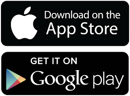

# Android

**Android** es un sistema operativo móvil desarrollado por Google y la **Open Handset Alliance**. Es el más extendido actualmente y está integrado en la mayoría de los teléfonos (Samsung, LG, Sony, Huawei, ...).

Es un sistema operativo cuya filosofía parte de ser un entorno abierto para que cualquier programador y fabricante pueda modificarlo a su gusto para posteriormente distribuirlo.

## Store

La tienda de apps de Android es llamada Play Store o Google Play. En principio no se aconseja instalar apps que no se descarguen de ahí, pero se puede hacer a través de otros programas.

## Versiones

Ha visto un gran número de actualizaciones a su sistema operativo base desde su lanzamiento original. Estas actualizaciones típicamente corrigen fallos de programa y agregan nuevas funcionalidades

Desde abril de 2009, las versiones de Android han sido desarrolladas bajo un nombre en clave y sus nombres siguen un orden alfabético:

| Versión | Nombre Clave       | Lanzamiento |
| ------- | ------------------ | ----------- |
| 1.0     | Alpha              | 23/09/2008  |
| 1.1     | Beta               | 09/02/2009  |
| 1.5     | Cupcake            | 27/04/2009  |
| 1.6     | Donut              | 15/09/2009  |
| 2.0     | Eclair             | 26/10/2009  |
| 2.2     | Froyo              | 20/05/2010  |
| 2.3     | Gingerbread        | 06/12/2010  |
| 3.0     | Honeycomb          | 22/02/2011  |
| 4.0     | Ice Cream Sandwich | 18/10/2011  |
| 4.1-4.3 | Jelly Bean         | 09/07/2012  |
| 4.4     | KitKat             | 31/10/2012  |
| 5.0     | Lollipop           | 12/11/2014  |
| 6.0     | Marshmallow        | 05/10/2015  |
| 7.0     | Nougat             | 22/08/2016  |
| 8.0     | Oreo               | 21/08/2017  |
| 9.0     | Pie                | 06/08/2018  |
| 10.0    | Q                  | 03/09/2019  |
| 11.0    | R                  | 09/06/2020  |
| 12.0    | S                  | 08/09/2020  |

## Última versión estable

**Android 12** es la actual última versión para Android, a falta de que la beta de Android 13 siga evolucionando hasta alcanzar la madurez y ser lanzada oficialmente.

## Capa de personalización

Cada fabricante tiene una visión de Android diferente y, basándose en ella, desarrolla lo que conocemos como capas de personalización

Una capa de personalización es un componente de software que proporciona una experiencia de usuario personalizada al personalizar la presentación del contenido al usuario.

Los principales son:

## Nube de Android

Se sirve actualmente de la nube de Google (Google drive) para almacenar documentos, fotos, contactos, correo, etc. Y se integra con los productos de la Google Suite.

Las cuentas personales utilizan el servicio Google One.

Las cuentas profesionales o de centros educativos utilizan Google Workspace, y por tanto tienen unas características diferentes.

## Espacio de almacenamiento

Todas las cuentas de Google empiezan con 15 GB de almacenamiento gratuito en Google Drive, Gmail y Google Fotos.

Podéis consultar el espacio que tenéis usado aquí: https://one.google.com/u/0/

Copia de seguridad del smartphone

Aumentar el espacio de almacenamiento

Google One es un plan de suscripción (de pago)  que te proporciona más espacio de almacenamiento en Google Fotos, Drive y Gmail.

Cuando te pasas a Google One, el almacenamiento aumenta a 100 GB o más dependiendo del plan que elijas. A cambio, se te cobra una tarifa mensual en función de la opción que elijas.

## Compartir Google One

Puedes compartir Google One con hasta cinco familiares sin coste adicional (es decir, seis en total si te incluyes).

Los miembros de tu familia comparten el espacio de almacenamiento de tu plan de Google One, pero no pueden ver lo que almacenas si no lo compartes con ellos desde Google Drive, Gmail o Google Fotos.

## Google Workspace

Google Workspace for Education es un conjunto de herramientas y servicios de Google ideados para centros educativos tradicionales y otras instituciones que imparten educación en casa. Está disponible para todas las instituciones educativas que cumplan los requisitos.

Google Workspace for Education Fundamentals es gratis para las instituciones educativas que cumplan los requisitos.

Education Fundamentals proporciona 10.000 licencias de usuario

En todas las ediciones, elcentro educativo obtiene 100 TB de almacenamiento conjunto

https://workspace.google.com/intl/es/features/

