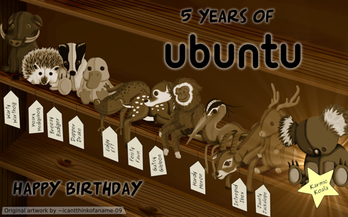

# Linux

Un sistema operativo (como Windows)
Libre
Se puede modificar y mejorar libremente
Código de programación abierto
Gratuito
No hay que pagar nada por el

FSF y proyecto GNU

Iniciado por Richard Stallman (1984)
FSF (free software foundation)
Quiere conseguir software que el usuario pueda
Copiar, modificar y distribuir software
Entre otros, un SO
GNU
SO libre y gratuito

## ¿Cómo se mantiene?

Linux es mantenido principalmente por la **comunidad** de desarrollo de código abierto. Esta comunidad está compuesta por miles de programadores de todo el mundo que trabajan de manera desinteresada para mejorar el sistema operativo. Estos **programadores** ofrecen su tiempo, experiencia y conocimiento para mejorar el código de Linux.

Esta comunidad también recibe el apoyo de **empresas**, quienes patrocinan algunos proyectos de desarrollo de Linux. Además, la comunidad de Linux también recibe donaciones de usuarios que apoyan el desarrollo del sistema.

##  Historia del software libre y distribuciones

##  Componentes de Linux

## ##  Kernel

Núcleo del S.O.
Permite controlar el hardware de la máquina

## ##  Entorno gráfico (DE)

Necesario para que el usuario lo use
Diferentes entornos:
Gnome, KDE, Beryl, Unity

##  Sistemas Linux

Los sistemas operativos Linux son desarrollados bajo la **Licencia GPL**. Estos son usados por empresas, asociaciones y colectivos de personas. El núcleo (Kernel) es la base del sistema operativo y a partir de él se desarrollan diferentes versiones.

Actualmente hay más de 400 distribuciones de Linux que se adaptan a las necesidades de los usuarios.

##  Distribuciones Linux

Linux es libre
Modificar y mejorar libremente
Grupos de usuarios
Modifican a su gusto
Añaden
Aplicaciones, utilidades, herramientas de instalación, etc
Crean una distribución y le ponen un nombre

https://distrowatch.com/

##  Distribuciones CCAA

A las CCAA les interesa Linux
Es gratuito, no tienen que pagar licencias
Cada comunidad autónoma
Adapta una versión de linux a sus necesidades (colegios, ayuntamientos)
Elige las aplicaciones que quiere que tenga
Ofimática, facturación, etc
Crea una distribución propia
Linex,guadalinex,lliurex,max,linkat,etc

##  Distribuciones CCAA más importantes

- Guadalinex (Guadalajara): Ubuntù+Gnome
- Lliurex (Comunitat valenciana): Edubuntu
- Molinux (Castilla la mancha): Ubuntu+Gnome
- Linex (Extremadura): Debian
- Max (Madrid): Ubuntu+GNOME
- Linkat (Generalitat de Catalunya): Suse linux + GNOME

Lista completa de distribuciones CCAA

## Ubuntu

Ubuntu es un sistema operativo de código abierto basado en GNU/Linux y que se distribuye gratuitamente. Fue creado en 2004 por la compañía sudafricana **Canonical** Ltd. y se ha convertido en una de las distribuciones más populares de GNU/Linux.

Es la distribución más popular hoy en día
Basada en debian
Instalado salas de informática
Gestor de arranque
Versión que utiliza consellería en los colegios y en los IES

## arranque DUAL

El arranque dual es una característica que permite a un usuario iniciar un sistema operativo (OS) desde dos dispositivos de almacenamiento diferentes. Esto significa que un usuario puede elegir entre dos sistemas operativos diferentes al iniciar una computadora; por ejemplo, un usuario puede iniciar una computadora con Windows u otro sistema operativo, como Linux. El sistema operativo seleccionado se cargará **automáticamente** y se ejecutará.

## instalación de Linux

Para instalar Linux, existen diferentes opciones. Una de ellas es **descargar una imagen** CD/DVD, grabarla y arrancar desde el CD/DVD para completar la instalación. Esta instalación requiere modificar el disco duro.

Otra opción es utilizar un **LiveCD**, el cual no instala nada en el disco duro, sino que permite probar una versión de Linux y al apagar, todo vuelve a su estado original.

Finalmente, es posible instalar Linux desde **Windows**, descargando un programa que se instala como una aplicación más, y que se puede desinstalar cuando se quiera.

## Versiones Ubuntu

