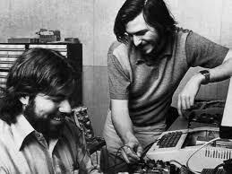
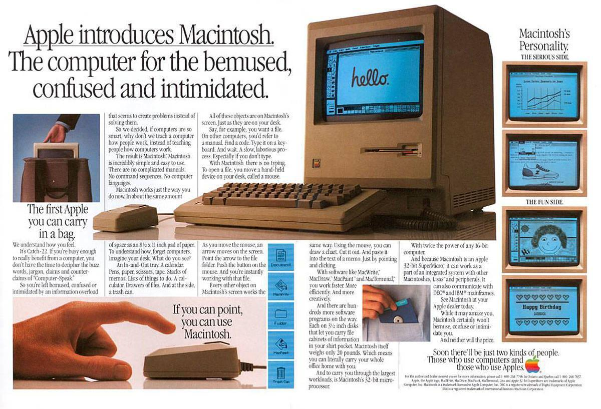
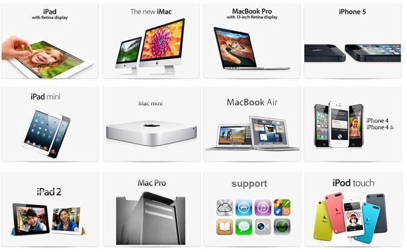
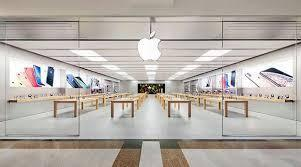
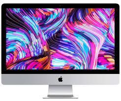
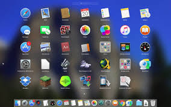
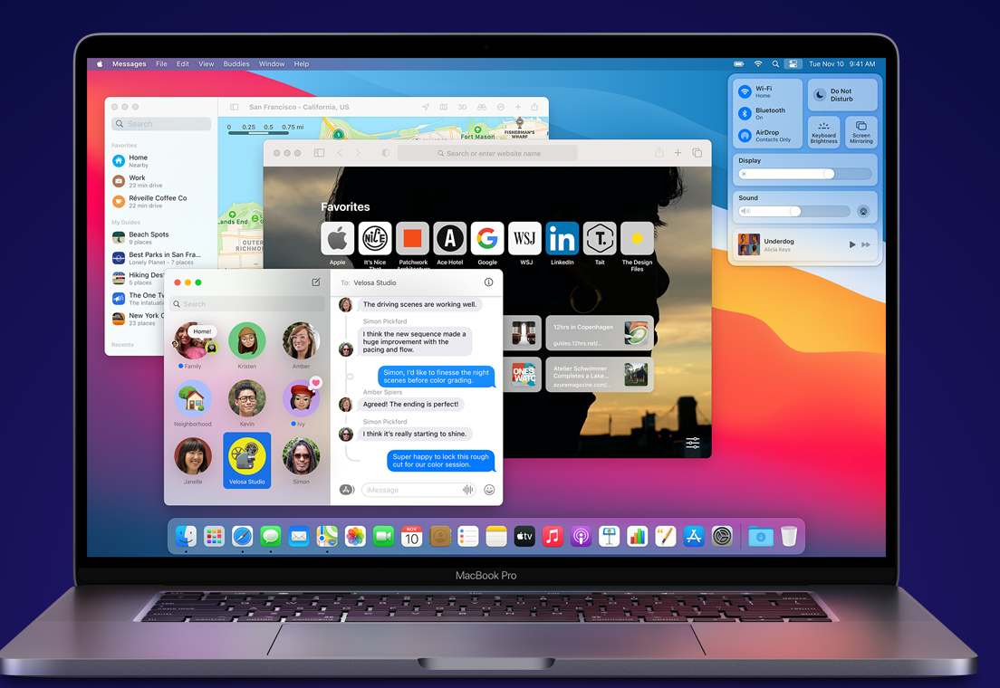
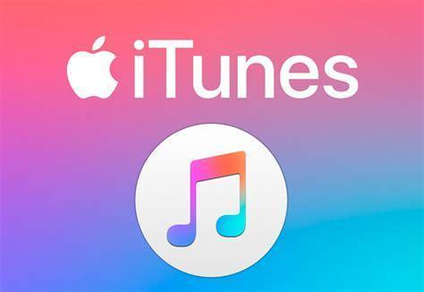
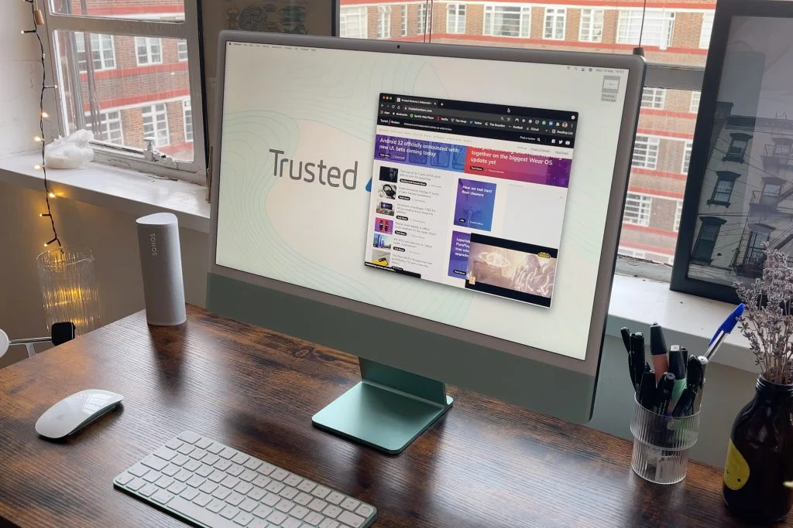
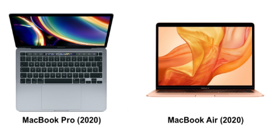

# Mac OS

---

Es un sistema operativo propiedad de la empresa Apple.

- Los sistemas operativos Mac OS solo funcionan en hardware de Apple.
- Suelen estar más optimizados para el hardware que están creados
- Son menos vulnerables a virus informáticos.

---

Versiones de Mac: https://ca.wikipedia.org/wiki/MacOS

---

## Apple

Apple es una empresa dedicada a diseñar equipos (iMac, iPhone, Apple Watch), programas (iOS) y servicios online (Apple TV, iCloud). Sus creadores son Steve Wozniak y Steve Jobs.

Se trata de una empresa que generalmente ha sido muy innovadora y puntera en su sector, que ha propiciado la invención y expansión de diversos equipos de la propia empresa que han tenido repercusión mundial.

---

---

## Productos

A lo largo de la historia, Apple ha ido introduciendo nuevos dispositivos en el mercado, como por ejemplo:

| Producto     | Año de lanzamiento |
| ------------ | ------------------ |
| iPod         | 2001               |
| iPhone       | 2007               |
| iPod Touch   | 2007               |
| MacBook Air  | 2008               |
| iPad         | 2010               |
| Apple pencil | Apple Pencil       |
| Apple Watch  | 2015               |
| AirPods      | 2016               |

---

---

Apple dispone además de tiendas propias o espacios en grandes centros comerciales conocidos como Apple Stores. También podemos comprar la mayoría de sus productos online a través de la página web de Apple.

---

## Mac OS: el sistema operativo

Los ordenadores de **Apple** suelen ser preferidos por diseñadores gráficos y de sonido. Los sistemas operativos Mac OS solo funcionan en hardware de Apple.  Suelen ser más sencillos de utilizar, con menos opciones, y estar más optimizados para el hardware que están creados y son menos vulnerables a virus informáticos.

Mac OS es el sistema operativo desarrollado por Apple para sus ordenadores Macintosh o Mac. Es un sistema operativo sencillo y fiable, con pocos fallos. Lo encontraremos en ordenadores de sobremesa y portátiles de Apple.

---

---

La última versión se llama **Mac OS Big Sur**. Otras versiones han sido:

| Product                   | Release Date       |
| ------------------------- | ------------------ |
| OS X 10.0 “Cheetah”       | March 24, 2001     |
| OS X 10.1 “Puma”          | September 25, 2001 |
| OS X 10.2 “Jaguar”        | August 24, 2002    |
| OS X 10.3 “Panther”       | October 24, 2003   |
| OS X 10.4 “Tiger”         | April 29, 2005     |
| OS X 10.5 “Leopard”       | October 26, 2007   |
| OS X 10.6 “Snow Leopard”  | August 28, 2009    |
| OS X 10.7 “Lion”          | July 20, 2011      |
| OS X 10.8 “Mountain Lion” | July 25, 2012      |
| OS X 10.9 “Mavericks”     | October 22, 2013   |
| OS X 10.10 “Yosemite”     | October 16, 2014   |
| OS X 10.11 “El Capitan”   | September 30, 2015 |
| macOS 10.12 “Sierra”      | September 20, 2016 |
| macOS 10.13 “High Sierra” | September 25, 2017 |
| macOS 10.14 “Mojave”      | September 24, 2018 |
| macOS 10.15 “Catalina”    | October 7, 2019    |
| macOS 11 “Big Sur”        | November 12, 2020  |

---

## Programas propios

Apple también desarrolla programas informáticos para Mac OS X. Desarrolla gran parte del software que incluye con sus ordenadores.

- iLife: orientado al consumidor que contiene iDVD, **iMovie**, iPhoto, iTunes, iWeb y GarageBand.
- Presentación, diseño de página y de procesamiento de textos, está disponible iWork, que incluye Keynote, Pages y Numbers.
- Otros como **iTunes**, el reproductor de medios **QuickTime** y el navegador **Safari** están disponibles como descargas gratuitas, tanto para macOS como para Windows.

---

---

## iMac y macbook

El iMac es una computadora de escritorio todo en uno con una pantalla de gran tamaño y un procesador potente. El MacBook es una computadora portátil de tamaño medio con una pantalla de 13 pulgadas.

---

---

El **MacBook Air** es una computadora portátil ultra liviana con una pantalla de 13 pulgadas. El **MacBook Pro** es una computadora portátil profesional con una pantalla de 15 o 17 pulgadas y un procesador más potente.

---

