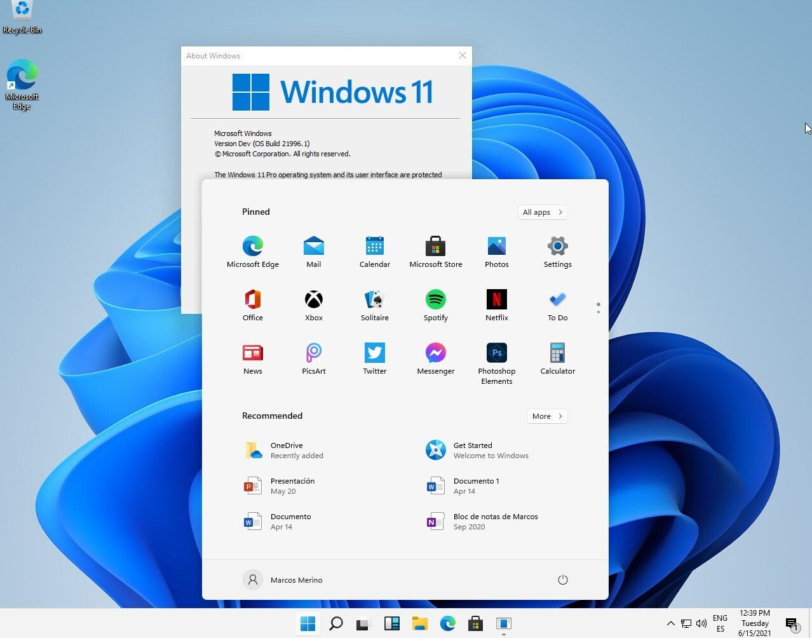
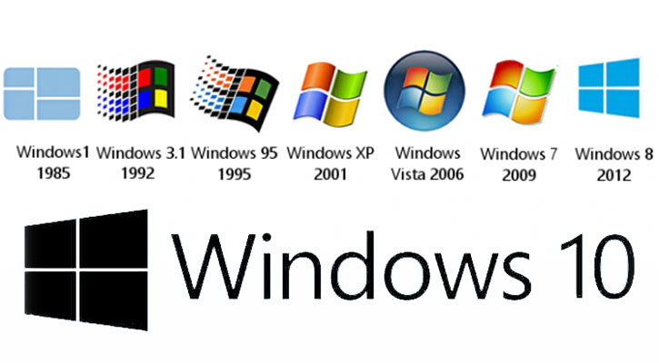
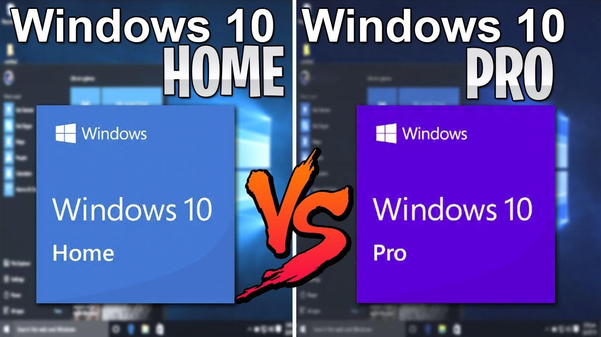

# Windows

**Windows** es un conjunto de sistemas operativos creado por **Microsoft**, la compañía de tecnología fundada por **Bill Gates** en 1975. Microsoft ha desarrollado y comercializado sistemas operativos Windows desde entonces. Bill Gates es el cofundador y ex director ejecutivo de Microsoft.

---

``Bill Gates`` es el cofundador de Microsoft y ha sido una figura clave en la historia de la informática y la tecnología, así como uno de los empresarios más exitosos y conocidos del mundo.

---

# Windows 11

Windows 11 es la última versión del sistema operativo Windows, lanzada por Microsoft el 5 de octubre de 2021. Cuenta con una interfaz de usuario rediseñada, con un nuevo menú Inicio, iconos de barra de tareas centrados y un Explorador de archivos modernizado. También incluye nuevas funciones como Snap Layouts, Snap Groups y escritorios virtuales para realizar múltiples tareas.

---

---

Windows 11 requiere un procesador compatible de 64 bits, 4 GB de RAM y 64 GB de almacenamiento. También es compatible con pantallas táctiles y entrada de lápiz, e incluye mejoras en el rendimiento y la seguridad de los juegos.

---

Los usuarios con una licencia válida de Windows 10 pueden actualizar a Windows 11 de forma gratuita a través de la configuración de Windows Update. Alternativamente, los usuarios pueden descargar los medios de instalación de Windows 11 desde el sitio web de Microsoft para realizar una instalación limpia en un dispositivo compatible.

---

---

Dentro de cada versión, tenemos diferentes subversiones, según las necesidades. Entre otras versiones, las más habituales son:

- La versión **Home** se utiliza en entornos domésticos, contiene las funciones básicas y es más económica.
- La versión **Pro** se utiliza en entornos de empresas, en los que se requiere acceso a un servidor y otras funciones avanzadas.

---

Versiones de Windows: https://ca.wikipedia.org/wiki/Llistat_de_les_versions_de_Microsoft_Windows
