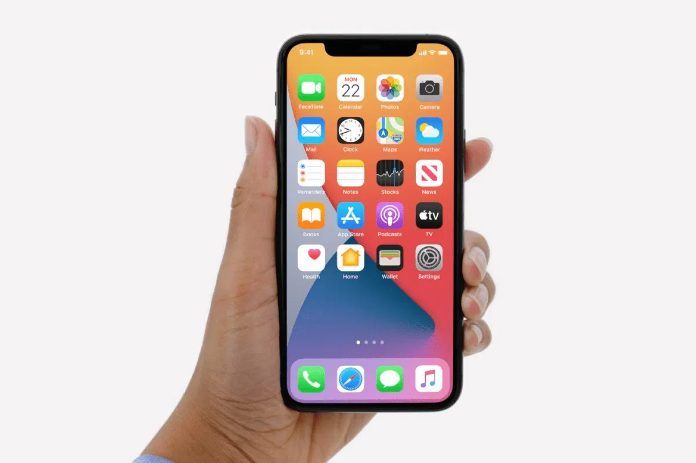
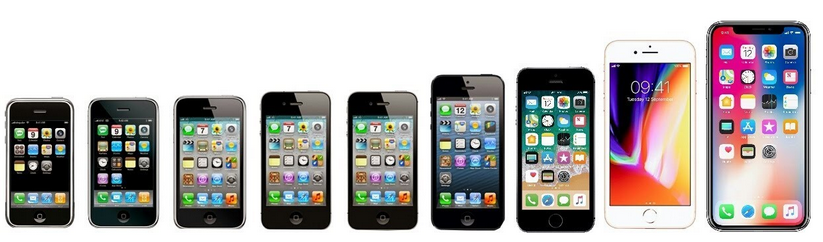
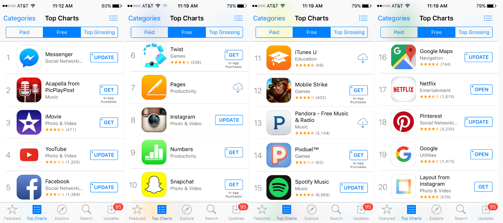

# iOS

**iOS** es un sistema operativo creado por Apple para su uso en dispositivos portátiles como el iPhone, iPod y iPad. Diseñado para ser intuitivo y fácil de usar, permitiendo al usuario tener una experiencia fluida y sin complicaciones a la hora de utilizar sus dispositivos.

Apple fabrica sus propios smartphones (iPhone) y el sistema operativo que incluye (iOS). De serie, trae un conjunto de programas propios de Apple incluidos, y podemos instalar otras apps de terceros, si queremos.

## El ecosistema de Apple

El ecosistema de Apple es una forma de referirse al conjunto de dispositivos y servicios de Apple. Estos productos y servicios se conectan entre sí.  Esto incluye la **sincronización** de contenido entre dispositivos, el aprovechamiento de los **recursos compartidos** entre ellos y la integración de **aplicaciones** y servicios.

Es un sistema operativo muy adaptado para los dispositivos Apple y aprovechan muy bien el hardware. La última versión a día de hoy es el iPhone 12. La última versión es iOS 14. En IPad se ha creado una versión diferente llamada iPadOS, más adaptada a las necesidades de una tablet.

## App store

Su tienda de apps es la App store. A este store solo se puede acceder con dispositivos de Apple, y no se pueden instalar aplicaciones que no provengan de ella. En general, algunas aplicaciones solo tienen versión para App store y las aplicaciones suelen ser más caras que sus respectivas versiones de Android.

Tiene aplicaciones exclusivas para iOS y otras multiplataforma (también para Android). Instalar apps desde otro lugar no es posible, a no ser que se realice un Jailbreak. Esto se debe a que Apple mantiene un gran control sobre el contenido disponible en la App Store, lo que ofrece una mayor seguridad a los usuarios.

## iCloud

iCloud es un servicio creado por Apple que ofrece la posibilidad de guardar datos en servidores de Apple (la nube) y sincronizarlos en los diferentes dispositivos Apple usados por una misma persona, además de servir como copia de seguridad.

Como parte de sus beneficios, ofrece 5 GB de almacenamiento gratuito, que se puede ampliar pagando una cuota mensual. De esta manera, los cambios realizados en un dispositivo aparecerán en todos los demás dispositivos. iCloud ofrece diferentes planes y precios para su almacenamiento.