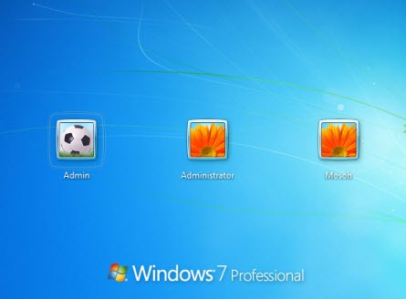

# Sistemas operativos

Un **sistema operativo** es un programa esencial que hace que tu ordenador funcione. Es una especie de "cerebro" que controla todo lo que sucede en tu ordenador. Controla cosas como el hardware, los programas y la forma en que se muestran los datos en la pantalla. Cuando se enciende el ordenador, el sistema operativo se encarga de que todos los programas funcionen correctamente.

## Funciones del SO

- Se encarga de gestionar para el usuario el hardware
- Es el programa básico sin el cual un ordenador, una tablet o un smartphone no podría funcionar.
- Comienza a trabajar en cuanto se enciende el dispositivo y es completamente fundamental para que el usuario trabaje con él.

Los sistemas operativos realizan tareas básicas y, sin ellos, el dispositivo no funcionaría.

Así, por ejemplo, el sistema operativo reconoce la conexión del teclado de un ordenador, organiza y ordena los archivos, controla la impresora, la pantalla, etc. Se encarga de que los programas no interfieran entre ellos.

## Ejemplos de sistemas operativos

Existen sistemas operativos en casi cualquier dispositivo electrónico. En dispositivos móviles como smartphones y tablets podemos encontrar, por ejemplo, los siguientes:

| Sistema Operativo | Compañía   | Año de Lanzamiento |
| ----------------- | ---------- | ------------------ |
| iOS               | Apple      | 2007               |
| Android           | Google     | 2008               |
| Windows Phone     | Microsoft  | 2010               |
| BlackBerry OS     | BlackBerry | 1999               |
| Symbian           | Nokia      | 1998               |

En ordenadores de sobremesa o portátiles tendremos otros sistemas operativos:

| Nombre                      | Desarrollador         | Fecha de lanzamiento |
| --------------------------- | :-------------------- | :------------------: |
| [Windows](windows/index.md) | Microsoft             |         1985         |
| Mac OS X                    | Apple                 |         2001         |
| Linux                       | Comunidad de usuarios |         1991         |
| Chrome OS                   | Google                |         2011         |

## SO multiusuario y multitarea

Hoy día los sistemas operativos son siempre multiusuario y multitarea. ¿qué significa
esto?

- **Multiusuario**: Un sistema operativo es multiusuario cuando puedes tener configurados en él varios usuarios distintos. Por ejemplo en casa, un usuario para ti, otro para tu hermano y otro para tus padres.

- **Multitarea**: Un Sistema operativo es multitarea cuando puede ejecutar varios programas a la vez. Está claro que Windows lo es ya que, por ejemplo, mientras escribes un texto en el Word, puedes estar escuchando música y navegando por Internet.

## Programas o aplicaciones

Sobre el sistema operativo se instalan los programas que vaya a usar el usuario. Los programas, también llamados **aplicaciones**, son muy diversos.

Ejemplo:

- El procesador de textos Word en un ordenador con Windows
- La aplicación de mensajería Whatsapp en un móvil con Android o IOS.