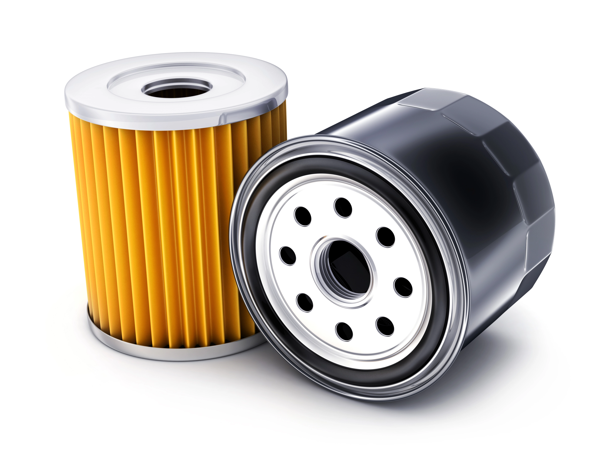

[🔙 Enrere](../) | [🏠 Pàgina principal](http://danimrprofe.github.io/apuntes/)

# Lubrificació

La lubricació és el procés de posar una substància entre dues peces per disminuir el fregament i prevenir l'oxidació, la brutícia i altres formes de desgast. Això produeix una millor eficiència i vida útil dels mecanismes.

Un manteniment adequat del sistema de lubricació i la neteja també són essencials per a una lubricació eficaç. Si la lubricació és inadequada o insuficient, es pot provocar un augment del fregament i de la temperatura, cosa que pot accelerar el desgast i afectar negativament la vida útil dels mecanismes.

---
# Olis

Denominació

Societat d’enginyers automovilistes (SAE)

Estableix escala de denominacions segons consistència

Lletra W (Ex: 40W)

Olis mes fluits

---
# Circuits

Els sistemes de lubrificació disposen de diferents mecanismes per a la recirculació del lubricant. L'oli ha de ser bombejat a través del circuit i després retornat a un recipient (càrter) on es recull.

A partir d'aquí, el procés comença de nou. La reutilització de l'oli requereix filtració. El filtratge en derivació implica la presa d'una derivació d'oli a pressió abans de que arribi als punts de lubricació per passar-lo per un filtre.

---

---

Això té l'avantatge que, si el filtre s'obstrueix, la lubricació no es veu afectada. El filtratge en ple cabal implica que una bomba recull l'oli del càrter i l'envia directament al filtre, i s'utilitza en motors de velocitat baixa.

 ---