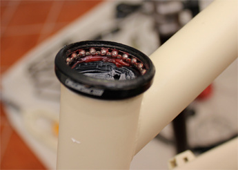

[游댗 Enrere](../) | [游 P많ina principal](http://danimrprofe.github.io/apuntes/)

# Soporte de elementos mecánicos

---

Los ``cojinetes`` y ``rodamientos`` se utilizan en una gran variedad de máquinas, desde ventiladores y bombas hasta automóviles y aviones.

---

Los ``rodamientos`` son especialmente importantes en las ruedas de los automóviles, ya que soportan el peso del vehículo y permiten que las ruedas se muevan libremente.

---
# Cojinetes

Un ``cojinete`` es un dispositivo que se utiliza para reducir la fricción entre las piezas móviles de una máquina. Esto permite que las piezas se muevan más fácilmente y con menos desgaste.

---

---
<!-- _class: invert -->