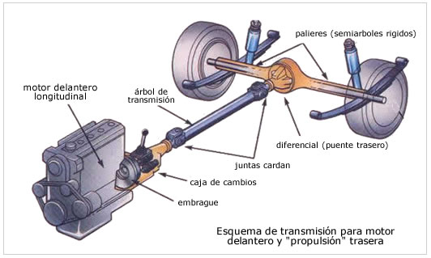
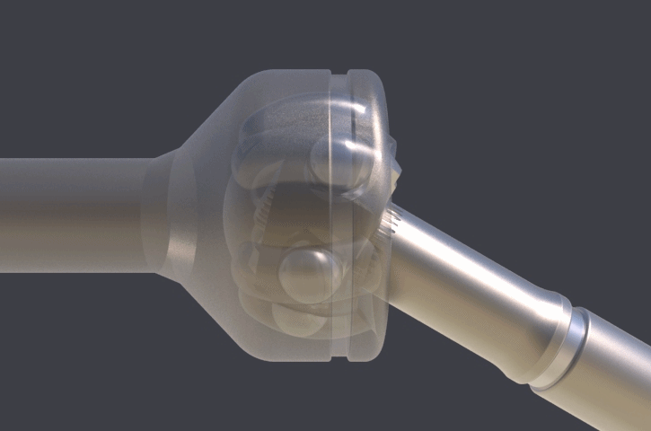
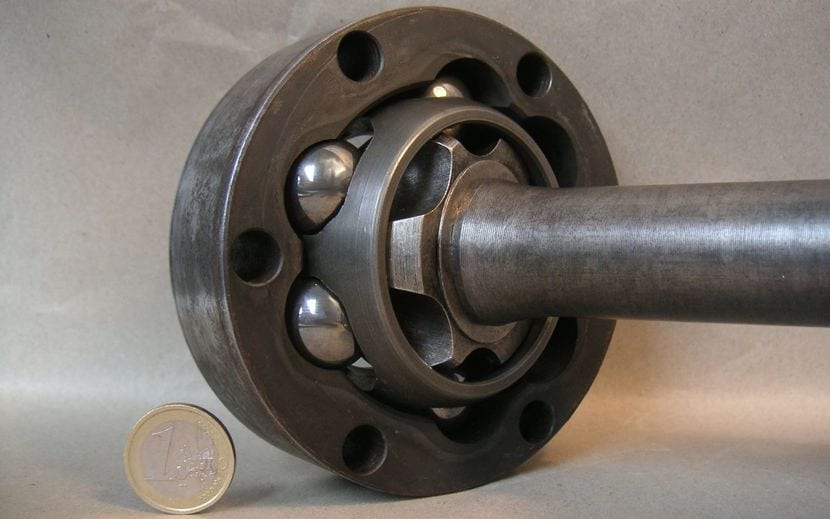
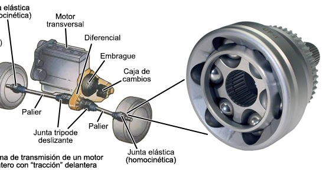

# <!--fit --> Mecanismes d’acoblament d’eixos
---

Son dispositivos que se utilizan para conectar dos ejes de manera que puedan transmitir energía mecánica entre ellos. Los acoplamientos pueden ser de diferentes tipos, como acoplamientos rígidos, flexibles, de engranajes, hidráulicos, entre otros, y se utilizan en una amplia gama de aplicaciones mecánicas.

---
# Acoblament per maniguet

Acoblament per maniguet és un tipus senzill i tosc d'acoblament adequat per a màquines amb velocitats reduïdes i d'ús ocasional. L'estructura està formada per un maniguet de fundició amb un canal interior que acull dues xavetes, les quals sostenen els extrems dels eixos i es fixen al maniguet mitjançant cargols de cap avellanat. Una protecció de xapa cobreix els talons de les xavetes per a evitar que surtin de les ranures del maniguet.

---

Debido a l'asimetria produïda per les ranures i les xavetes, així com l'excentricitat que es produeix per la introducció forçada de les xavetes, és important allunyar el centre de gravetat de l'acoblament dels arbres per a evitar vibracions i irregularitats en el moviment. A més, es pot assegurar la unió entre el maniguet i els arbres mitjançant clavilla cònica transversal si l'esforç a transmetre és petit.

---

# JUNTA CARDAN

La junta Cardan és un element mecànic que s'utilitza per a transferir el moviment de rotació d'un eix a un altre quan estan desalineats. Està formada per dues forquilles solidàries als arbres d'entrada i de sortida, i una peça central denominada creueta.

---

Quan l'eix d'entrada gira, arrossega la creueta, i aquesta a la vegada arrossega l'eix de sortida. No obstant, la velocitat de gir de sortida sofreix algunes variacions a causa dels angles que es formen.

Per evitar aquestes variacions, s'instal·len sempre dues juntes Cardan que es compensen entre si. A aquest element se l'anomena doble Cardan.

---

---
# Junta homocinètica

La junta homocinètica té com a finalitat connectar dos eixos situats longitudinalment que no són continus, de manera que la velocitat entre ells sigui sempre igual.

Aquesta connexió es fa a través del palier de transmissió de les rodes, que s'uneix per un extrem amb el diferencial i per l'altre amb la caixa de la roda.

---

---

Aquesta transmissió està sotmesa a moviments oscil·latoris de la suspensió i moviments giratoris de la direcció, per la qual cosa ha de ser articulada. La junta homocinètica actua com una mena de ròtula complexa que permet aquests moviments sense que les rodes perdin tracció ni les transmissions es vegin afectades.

---

---

---

# Embrague

El ``embrague`` de un coche es un sistema mecánico que se encuentra entre el ``motor`` y la ``caja de cambios``.

Su función principal es ``desacoplar`` momentáneamente el motor de la transmisión para permitir cambios de marcha suaves y precisos.

https://www.youtube.com/watch?v=WxRq_bNBmjQ

https://www.youtube.com/watch?v=4Syt_01ZRzA

---

# Embragatges. Accionament

- ``L'accionament mecànic`` es compon de diversos elements que integren el comandament de l'embragatge, com ara el ``pedal`` d'accionament, el ``cable`` que transmet l'esforç, la palanca de dessembragatge i el ``coixinet`` que desplaça els elements de fricció.

- ``L'accionament hidràulic`` s'utilitza quan es necessita realitzar un major esforç o quan la distància entre el pedal i l'embragatge és molt llarga. Aquest sistema es compon de cilindres emissor i receptor, un dipòsit per a líquid hidràulic i una canonada de canalització.

---