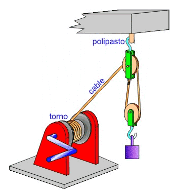
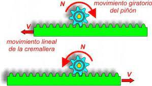
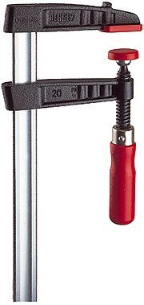
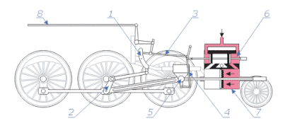
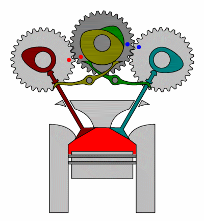

# Mecanismos de transformación

## Movimiento **circular-rectilíneo**

---
# manivela-torno

Es un dispositivo que convierte el movimiento circular en movimiento lineal o viceversa. Consiste en una manivela que gira alrededor de un eje y que está conectada a un mecanismo de torno que se encarga de transformar el movimiento.

---

---

---
# piñón-cremallera

Es un sistema de engranajes que se utiliza para transformar el movimiento circular en movimiento lineal. Consiste en un piñón que gira alrededor de un eje y que se conecta a una cremallera que se mueve linealmente. Al girar el piñón, la cremallera se desplaza en la dirección deseada.

---

---
# Tornillo-tuerca

Es un sistema de rosca que se utiliza para transformar el movimiento circular en movimiento lineal. Consiste en un ``tornillo`` con una ``rosca`` que se conecta a una ``tuerca`` con una rosca correspondiente. Al girar el tornillo, la tuerca se desplaza a lo largo del tornillo en la dirección deseada.

---

---

---

# Tornillo sin fin

Es un tipo de engranaje que se utiliza para transformar el movimiento circular en movimiento lineal. Consiste en un tornillo con una rosca sin fin que se conecta a una rueda dentada que se llama corona. Al girar el tornillo sin fin, la corona se desplaza en la dirección deseada.

---

Este sistema se utiliza principalmente en maquinaria que requiere un alto grado de precisión, como los relojes, y también para sistemas reductores de la velocidad.

Se trata de un sistema que no reversible.

---
<!-- _class: invert -->

# Mecanismos de transformación
## Circular-rectilíneo alternativo

---
# Biela-manivela

Es un mecanismo que se utiliza para transformar el movimiento lineal en movimiento circular o viceversa. Consiste en una ``biela``, que es una barra que se mueve linealmente, conectada a una ``manivela``, que es un brazo que gira alrededor de un eje. Al mover la biela, la manivela gira y viceversa.

---
# Leva y excéntrica

Son mecanismos que se utilizan para transformar el movimiento circular en movimiento lineal o viceversa. Una leva es una pieza de forma irregular que se mueve en un movimiento circular y que, al hacer contacto con otra pieza, produce un movimiento lineal.

---
# Árbol de levas

Un árbol de levas es un componente del motor de combustión interna que se encarga de controlar la apertura y cierre de las válvulas de admisión y escape. Es un eje con levas o protuberancias que giran en sincronización con el movimiento del cigüeñal, y que están diseñadas para presionar sobre los taqués o balancines, moviendo a su vez las válvulas.

---

El árbol de levas puede estar ubicado en la culata o en el bloque del motor, dependiendo del diseño del motor. En los motores de cuatro tiempos, el árbol de levas gira a la mitad de la velocidad del cigüeñal y tiene tantas levas como válvulas tenga el motor.

---

# Excéntrica

Una ``excéntrica`` es una pieza circular que gira alrededor de un eje descentrado y que se utiliza para producir un movimiento lineal.

---

# Cigüeñal

Es un componente importante en la mayoría de los motores de combustión interna. Se utiliza para transformar el movimiento lineal de los pistones en movimiento circular. Consiste en un eje que gira alrededor de un punto central y que tiene una serie de contrapesos y muñequillas en ángulos específicos. 

---

Los ``pistones`` se conectan a las muñequillas y, al girar el cigüeñal, se produce un movimiento circular que impulsa el motor.

---
<!-- _class: invert -->